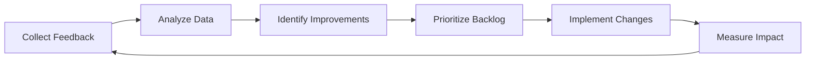
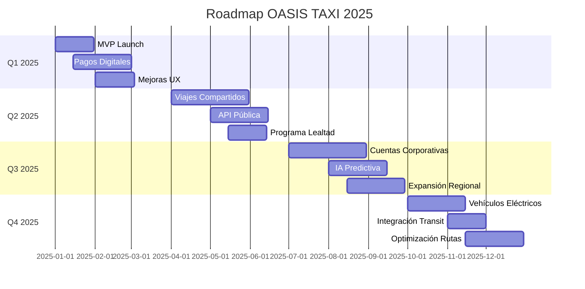
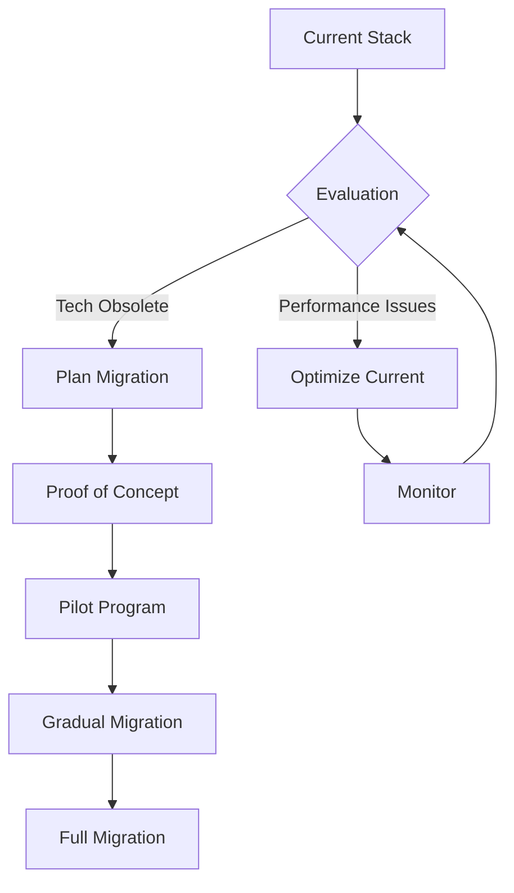

# Testing, CI/CD y Operaciones - OASIS TAXI

## 10. Pruebas Automatizadas

### Estrategia de Testing

```
┌─────────────────────────────────────────────────┐
│              Pirámide de Testing                │
├─────────────────────────────────────────────────┤
│     E2E Tests (10%)                            │
│     - Flujos críticos completos                │
│     - Cross-platform                           │
├─────────────────────────────────────────────────┤
│     Integration Tests (30%)                    │
│     - API endpoints                            │
│     - Servicios externos                       │
│     - Base de datos                            │
├─────────────────────────────────────────────────┤
│     Unit Tests (60%)                           │
│     - Lógica de negocio                        │
│     - Widgets                                  │
│     - Utilidades                               │
└─────────────────────────────────────────────────┘
```

### Testing en Flutter

#### Unit Tests

```dart
// test/services/ride_service_test.dart
import 'package:flutter_test/flutter_test.dart';
import 'package:mockito/mockito.dart';
import 'package:oasis_passenger/services/ride_service.dart';

class MockApiClient extends Mock implements ApiClient {}
class MockLocationService extends Mock implements LocationService {}

void main() {
  group('RideService', () {
    late RideService rideService;
    late MockApiClient mockApiClient;
    late MockLocationService mockLocationService;
    
    setUp(() {
      mockApiClient = MockApiClient();
      mockLocationService = MockLocationService();
      rideService = RideService(mockApiClient, mockLocationService);
    });
    
    test('should calculate correct fare estimate', () async {
      // Arrange
      const pickup = Location(lat: -12.0464, lng: -77.0428);
      const destination = Location(lat: -12.0564, lng: -77.0528);
      
      when(mockApiClient.post('/rides/estimate', any))
          .thenAnswer((_) async => Response(data: {
            'distance': 5.2,
            'duration': 15,
            'estimatedFare': 18.50,
          }));
      
      // Act
      final estimate = await rideService.getFareEstimate(pickup, destination);
      
      // Assert
      expect(estimate.distance, equals(5.2));
      expect(estimate.duration, equals(15));
      expect(estimate.fare, equals(18.50));
    });
    
    test('should handle network errors gracefully', () async {
      // Arrange
      when(mockApiClient.post(any, any))
          .thenThrow(NetworkException('No internet'));
      
      // Act & Assert
      expect(
        () => rideService.createRide(CreateRideRequest()),
        throwsA(isA<NetworkException>()),
      );
    });
  });
}
```

#### Widget Tests

```dart
// test/widgets/ride_request_button_test.dart
import 'package:flutter/material.dart';
import 'package:flutter_test/flutter_test.dart';
import 'package:oasis_passenger/widgets/ride_request_button.dart';

void main() {
  testWidgets('RideRequestButton shows loading state', (tester) async {
    // Arrange
    bool isLoading = false;
    await tester.pumpWidget(
      MaterialApp(
        home: StatefulBuilder(
          builder: (context, setState) {
            return RideRequestButton(
              isLoading: isLoading,
              onPressed: () {
                setState(() => isLoading = true);
              },
            );
          },
        ),
      ),
    );
    
    // Act
    await tester.tap(find.byType(RideRequestButton));
    await tester.pump();
    
    // Assert
    expect(find.byType(CircularProgressIndicator), findsOneWidget);
    expect(find.text('Solicitar Viaje'), findsNothing);
  });
}
```

#### Integration Tests

```dart
// integration_test/app_test.dart
import 'package:flutter_test/flutter_test.dart';
import 'package:integration_test/integration_test.dart';
import 'package:oasis_passenger/main.dart' as app;

void main() {
  IntegrationTestWidgetsFlutterBinding.ensureInitialized();
  
  group('end-to-end test', () {
    testWidgets('complete ride flow', (tester) async {
      app.main();
      await tester.pumpAndSettle();
      
      // Login
      await tester.enterText(find.byKey(Key('email_field')), 'test@test.com');
      await tester.enterText(find.byKey(Key('password_field')), 'password123');
      await tester.tap(find.byKey(Key('login_button')));
      await tester.pumpAndSettle();
      
      // Request ride
      await tester.tap(find.byKey(Key('where_to_field')));
      await tester.pumpAndSettle();
      
      await tester.enterText(
        find.byKey(Key('destination_search')), 
        'Plaza de Armas'
      );
      await tester.pumpAndSettle();
      
      await tester.tap(find.text('Plaza de Armas, Lima'));
      await tester.pumpAndSettle();
      
      // Verify fare estimate
      expect(find.textContaining('S/'), findsOneWidget);
      
      // Confirm ride
      await tester.tap(find.byKey(Key('confirm_ride_button')));
      await tester.pumpAndSettle();
      
      // Verify searching state
      expect(find.text('Buscando conductor...'), findsOneWidget);
    });
  });
}
```

### Testing en Backend

#### Unit Tests

```typescript
// services/ride-service/src/tests/ride.service.test.ts
import { RideService } from '../services/ride.service';
import { PricingService } from '../services/pricing.service';
import { MatchingService } from '../services/matching.service';

describe('RideService', () => {
  let rideService: RideService;
  let mockPricingService: jest.Mocked<PricingService>;
  let mockMatchingService: jest.Mocked<MatchingService>;
  
  beforeEach(() => {
    mockPricingService = createMock<PricingService>();
    mockMatchingService = createMock<MatchingService>();
    rideService = new RideService(mockPricingService, mockMatchingService);
  });
  
  describe('createRide', () => {
    it('should create ride with correct pricing', async () => {
      // Arrange
      const request = {
        passengerId: 'pass-123',
        pickup: { lat: -12.0464, lng: -77.0428 },
        destination: { lat: -12.0564, lng: -77.0528 },
      };
      
      mockPricingService.calculateFare.mockResolvedValue({
        baseFare: 5.0,
        distanceCharge: 10.5,
        timeCharge: 3.0,
        total: 18.5,
      });
      
      // Act
      const ride = await rideService.createRide(request);
      
      // Assert
      expect(ride.pricing.total).toBe(18.5);
      expect(ride.status).toBe('pending');
      expect(mockMatchingService.findDrivers).toHaveBeenCalledWith(ride.id);
    });
  });
});
```

#### API Tests

```typescript
// services/ride-service/src/tests/api/rides.test.ts
import request from 'supertest';
import { app } from '../../app';
import { generateAuthToken } from '../helpers/auth';

describe('Rides API', () => {
  let authToken: string;
  
  beforeAll(async () => {
    authToken = await generateAuthToken('passenger');
  });
  
  describe('POST /api/rides', () => {
    it('should create ride successfully', async () => {
      const response = await request(app)
        .post('/api/rides')
        .set('Authorization', `Bearer ${authToken}`)
        .send({
          pickup: { lat: -12.0464, lng: -77.0428 },
          destination: { lat: -12.0564, lng: -77.0528 },
          paymentMethod: 'card',
        });
      
      expect(response.status).toBe(201);
      expect(response.body.data).toHaveProperty('id');
      expect(response.body.data.status).toBe('pending');
    });
    
    it('should validate required fields', async () => {
      const response = await request(app)
        .post('/api/rides')
        .set('Authorization', `Bearer ${authToken}`)
        .send({
          pickup: { lat: -12.0464, lng: -77.0428 },
          // Missing destination
        });
      
      expect(response.status).toBe(400);
      expect(response.body.error).toContain('destination');
    });
  });
});
```

### Testing de Performance

```typescript
// tests/performance/load-test.js
import http from 'k6/http';
import { check, sleep } from 'k6';

export const options = {
  stages: [
    { duration: '2m', target: 100 }, // Ramp up to 100 users
    { duration: '5m', target: 100 }, // Stay at 100 users
    { duration: '2m', target: 200 }, // Ramp up to 200 users
    { duration: '5m', target: 200 }, // Stay at 200 users
    { duration: '2m', target: 0 },   // Ramp down to 0 users
  ],
  thresholds: {
    http_req_duration: ['p(95)<500'], // 95% of requests under 500ms
    http_req_failed: ['rate<0.1'],    // Error rate under 10%
  },
};

export default function () {
  const BASE_URL = 'https://api.oasistaxiapp.com';
  
  // Simulate ride request
  const payload = JSON.stringify({
    pickup: { lat: -12.0464, lng: -77.0428 },
    destination: { lat: -12.0564, lng: -77.0528 },
  });
  
  const params = {
    headers: {
      'Content-Type': 'application/json',
      'Authorization': 'Bearer ' + __ENV.AUTH_TOKEN,
    },
  };
  
  const res = http.post(`${BASE_URL}/api/rides/estimate`, payload, params);
  
  check(res, {
    'status is 200': (r) => r.status === 200,
    'response time < 500ms': (r) => r.timings.duration < 500,
  });
  
  sleep(1);
}
```

### Testing de Seguridad

```bash
# security-test.sh
#!/bin/bash

echo "🔒 Running Security Tests..."

# OWASP ZAP Scan
docker run -t owasp/zap2docker-stable zap-baseline.py \
  -t https://api.oasistaxiapp.com \
  -r security-report.html

# Dependency Check
npm audit --production
flutter pub audit

# Secret Scanning
trufflehog --regex --entropy=True .

# SAST Analysis
semgrep --config=auto .

echo "✅ Security tests completed"
```

## 11. CI/CD End-to-End en Cloud Build

### Pipeline Principal

```yaml
# .cloudbuild/cloudbuild.yaml
steps:
  # 1. Setup
  - name: 'gcr.io/cloud-builders/gcloud'
    id: 'setup'
    entrypoint: 'bash'
    args:
      - '-c'
      - |
        echo "Branch: ${BRANCH_NAME}"
        echo "Commit: ${SHORT_SHA}"
        echo "Build: ${BUILD_ID}"

  # 2. Install Dependencies
  - name: 'node:20'
    id: 'install-backend'
    entrypoint: 'npm'
    args: ['ci']
    dir: 'backend'

  - name: 'cirrusci/flutter:3.24.0'
    id: 'install-flutter'
    entrypoint: 'bash'
    args:
      - '-c'
      - |
        cd apps/passenger && flutter pub get
        cd ../driver && flutter pub get
        cd ../admin && flutter pub get

  # 3. Linting
  - name: 'node:20'
    id: 'lint-backend'
    entrypoint: 'npm'
    args: ['run', 'lint']
    dir: 'backend'
    waitFor: ['install-backend']

  - name: 'cirrusci/flutter:3.24.0'
    id: 'lint-flutter'
    entrypoint: 'bash'
    args:
      - '-c'
      - |
        cd apps/passenger && flutter analyze
        cd ../driver && flutter analyze
        cd ../admin && flutter analyze
    waitFor: ['install-flutter']

  # 4. Testing
  - name: 'node:20'
    id: 'test-backend'
    entrypoint: 'npm'
    args: ['test', '--', '--coverage']
    dir: 'backend'
    env:
      - 'NODE_ENV=test'
    waitFor: ['lint-backend']

  - name: 'cirrusci/flutter:3.24.0'
    id: 'test-flutter'
    entrypoint: 'bash'
    args:
      - '-c'
      - |
        cd apps/passenger && flutter test --coverage
        cd ../driver && flutter test --coverage
        cd ../admin && flutter test --coverage
    waitFor: ['lint-flutter']

  # 5. Security Scanning
  - name: 'gcr.io/cloud-builders/gcloud'
    id: 'security-scan'
    entrypoint: 'bash'
    args:
      - '-c'
      - |
        # Vulnerability scanning
        gcloud container images scan ${_IMAGE_NAME}:${SHORT_SHA}

  # 6. Build Backend
  - name: 'gcr.io/cloud-builders/docker'
    id: 'build-backend'
    args:
      - 'build'
      - '-t'
      - 'gcr.io/${PROJECT_ID}/oasis-backend:${SHORT_SHA}'
      - '-t'
      - 'gcr.io/${PROJECT_ID}/oasis-backend:latest'
      - '--cache-from'
      - 'gcr.io/${PROJECT_ID}/oasis-backend:latest'
      - 'backend'
    waitFor: ['test-backend', 'security-scan']

  # 7. Build Flutter Apps
  - name: 'cirrusci/flutter:3.24.0'
    id: 'build-passenger-android'
    entrypoint: 'bash'
    args:
      - '-c'
      - |
        cd apps/passenger
        flutter build apk --release \
          --build-number=${BUILD_ID} \
          --build-name=${_VERSION}
    env:
      - 'ANDROID_SDK_ROOT=/opt/android-sdk'
    waitFor: ['test-flutter']

  - name: 'cirrusci/flutter:3.24.0'
    id: 'build-passenger-ios'
    entrypoint: 'bash'
    args:
      - '-c'
      - |
        cd apps/passenger
        flutter build ios --release --no-codesign \
          --build-number=${BUILD_ID} \
          --build-name=${_VERSION}
    waitFor: ['test-flutter']

  # 8. Deploy to Environment
  - name: 'gcr.io/cloud-builders/gcloud'
    id: 'deploy-backend'
    entrypoint: 'bash'
    args:
      - '-c'
      - |
        # Deploy to Cloud Run
        gcloud run deploy oasis-api-${_ENVIRONMENT} \
          --image gcr.io/${PROJECT_ID}/oasis-backend:${SHORT_SHA} \
          --platform managed \
          --region ${_REGION} \
          --allow-unauthenticated \
          --set-env-vars="NODE_ENV=${_ENVIRONMENT}"
    waitFor: ['build-backend']

  # 9. Run E2E Tests
  - name: 'gcr.io/cloud-builders/gcloud'
    id: 'e2e-tests'
    entrypoint: 'bash'
    args:
      - '-c'
      - |
        cd tests/e2e
        npm install
        npm run test:${_ENVIRONMENT}
    waitFor: ['deploy-backend']

  # 10. Upload to App Distribution
  - name: 'gcr.io/cloud-builders/gcloud'
    id: 'distribute-apps'
    entrypoint: 'bash'
    args:
      - '-c'
      - |
        # Upload APKs to Firebase App Distribution
        firebase appdistribution:distribute \
          apps/passenger/build/app/outputs/flutter-apk/app-release.apk \
          --app ${_FIREBASE_APP_ID_PASSENGER} \
          --groups "internal-testers" \
          --release-notes "Build ${BUILD_ID} - ${SHORT_SHA}"
    waitFor: ['build-passenger-android']

# Build configuration
options:
  machineType: 'E2_HIGHCPU_8'
  logging: CLOUD_LOGGING_ONLY

# Substitutions
substitutions:
  _ENVIRONMENT: 'dev'
  _REGION: 'us-central1'
  _VERSION: '1.0.0'
  _IMAGE_NAME: 'gcr.io/${PROJECT_ID}/oasis-backend'

# Artifacts
artifacts:
  objects:
    location: 'gs://${PROJECT_ID}_cloudbuild/artifacts/${BUILD_ID}'
    paths:
      - 'apps/*/build/**/*.apk'
      - 'apps/*/build/**/*.ipa'
      - 'coverage/**/*'

# Timeout
timeout: '3600s'
```

### Pipeline por Ambiente

```yaml
# .cloudbuild/dev.yaml
substitutions:
  _ENVIRONMENT: 'dev'
  _MIN_INSTANCES: '1'
  _MAX_INSTANCES: '10'

# .cloudbuild/staging.yaml
substitutions:
  _ENVIRONMENT: 'staging'
  _MIN_INSTANCES: '2'
  _MAX_INSTANCES: '50'

# .cloudbuild/prod.yaml
steps:
  # Additional production checks
  - name: 'gcr.io/cloud-builders/gcloud'
    id: 'prod-gate'
    entrypoint: 'bash'
    args:
      - '-c'
      - |
        # Check if approved for production
        if [[ ! -f ".approved-for-prod" ]]; then
          echo "❌ Production deployment not approved"
          exit 1
        fi

substitutions:
  _ENVIRONMENT: 'prod'
  _MIN_INSTANCES: '5'
  _MAX_INSTANCES: '100'
```

### Triggers de Cloud Build

```yaml
# terraform/modules/cicd/triggers.tf
resource "google_cloudbuild_trigger" "dev_trigger" {
  name        = "oasis-taxi-dev"
  description = "Trigger for dev environment"
  
  github {
    owner = "oasis-taxi"
    name  = "platform"
    push {
      branch = "^develop$"
    }
  }
  
  filename = ".cloudbuild/dev.yaml"
}

resource "google_cloudbuild_trigger" "staging_trigger" {
  name        = "oasis-taxi-staging"
  description = "Trigger for staging environment"
  
  github {
    owner = "oasis-taxi"
    name  = "platform"
    push {
      tag = "^v[0-9]+\\.[0-9]+\\.[0-9]+-rc.*$"
    }
  }
  
  filename = ".cloudbuild/staging.yaml"
}

resource "google_cloudbuild_trigger" "prod_trigger" {
  name        = "oasis-taxi-prod"
  description = "Trigger for production environment"
  
  github {
    owner = "oasis-taxi"
    name  = "platform"
    push {
      tag = "^v[0-9]+\\.[0-9]+\\.[0-9]+$"
    }
  }
  
  filename    = ".cloudbuild/prod.yaml"
  approval_config {
    approval_required = true
  }
}
```

## 12. Observabilidad y Métricas

### Stack de Observabilidad

```
┌─────────────────────────────────────────────────────┐
│             Observability Stack                      │
├─────────────────────────────────────────────────────┤
│ Metrics: Cloud Monitoring                           │
│ - Custom metrics (rides/min, revenue/hour)         │
│ - SLIs: Latency, Error rate, Saturation           │
├─────────────────────────────────────────────────────┤
│ Logging: Cloud Logging                             │
│ - Structured logs (JSON)                           │
│ - Log aggregation and analysis                     │
├─────────────────────────────────────────────────────┤
│ Tracing: Cloud Trace                               │
│ - Distributed tracing                              │
│ - Performance bottleneck identification            │
├─────────────────────────────────────────────────────┤
│ Error Tracking: Error Reporting + Crashlytics      │
│ - Real-time error alerts                           │
│ - Stack trace deduplication                        │
├─────────────────────────────────────────────────────┤
│ Uptime Monitoring: Cloud Monitoring                │
│ - Synthetic checks every 1 min                     │
│ - Multi-region monitoring                          │
└─────────────────────────────────────────────────────┘
```

### Implementación de Métricas

```typescript
// backend/shared/monitoring/metrics.ts
import { MetricServiceClient } from '@google-cloud/monitoring';

export class MetricsCollector {
  private client = new MetricServiceClient();
  
  async recordRideMetric(
    metricType: 'created' | 'completed' | 'cancelled',
    value: number = 1
  ) {
    const dataPoint = {
      interval: {
        endTime: {
          seconds: Date.now() / 1000,
        },
      },
      value: {
        int64Value: value,
      },
    };
    
    const timeSeries = {
      metric: {
        type: `custom.googleapis.com/ride/${metricType}`,
        labels: {
          environment: process.env.NODE_ENV,
          region: process.env.REGION,
        },
      },
      resource: {
        type: 'cloud_run_revision',
        labels: {
          project_id: process.env.PROJECT_ID,
          service_name: 'oasis-api',
          revision_name: process.env.K_REVISION,
        },
      },
      points: [dataPoint],
    };
    
    await this.client.createTimeSeries({
      name: this.client.projectPath(process.env.PROJECT_ID),
      timeSeries: [timeSeries],
    });
  }
  
  async recordLatency(operation: string, duration: number) {
    // Record p50, p95, p99 latencies
    const histogram = {
      metric: {
        type: 'custom.googleapis.com/api/latency',
        labels: {
          operation,
          environment: process.env.NODE_ENV,
        },
      },
      value: {
        distributionValue: {
          count: 1,
          mean: duration,
          bucketCounts: this.calculateBuckets(duration),
        },
      },
    };
    
    await this.client.createTimeSeries({
      name: this.client.projectPath(process.env.PROJECT_ID),
      timeSeries: [histogram],
    });
  }
}
```

### Logging Estructurado

```typescript
// backend/shared/logging/logger.ts
import { LoggingWinston } from '@google-cloud/logging-winston';
import winston from 'winston';

export const logger = winston.createLogger({
  level: process.env.LOG_LEVEL || 'info',
  format: winston.format.combine(
    winston.format.timestamp(),
    winston.format.errors({ stack: true }),
    winston.format.json()
  ),
  defaultMeta: {
    service: 'oasis-api',
    environment: process.env.NODE_ENV,
    version: process.env.APP_VERSION,
  },
  transports: [
    new winston.transports.Console(),
    new LoggingWinston({
      projectId: process.env.PROJECT_ID,
      keyFilename: process.env.GOOGLE_APPLICATION_CREDENTIALS,
      resource: {
        type: 'cloud_run_revision',
        labels: {
          service_name: 'oasis-api',
          revision_name: process.env.K_REVISION,
        },
      },
    }),
  ],
});

// Uso
logger.info('Ride created', {
  rideId: ride.id,
  passengerId: ride.passengerId,
  pickup: ride.pickup,
  destination: ride.destination,
  estimatedFare: ride.pricing.total,
  correlationId: req.headers['x-correlation-id'],
});
```

### Distributed Tracing

```typescript
// backend/shared/tracing/tracer.ts
import { TraceExporter } from '@google-cloud/opentelemetry-cloud-trace-exporter';
import { NodeSDK } from '@opentelemetry/sdk-node';
import { getNodeAutoInstrumentations } from '@opentelemetry/auto-instrumentations-node';

const sdk = new NodeSDK({
  traceExporter: new TraceExporter(),
  instrumentations: [
    getNodeAutoInstrumentations({
      '@opentelemetry/instrumentation-express': {
        enabled: true,
      },
      '@opentelemetry/instrumentation-http': {
        enabled: true,
      },
      '@opentelemetry/instrumentation-grpc': {
        enabled: true,
      },
    }),
  ],
});

sdk.start();

// Uso en servicios
import { trace } from '@opentelemetry/api';

const tracer = trace.getTracer('oasis-api');

export async function createRide(request: CreateRideRequest) {
  const span = tracer.startSpan('createRide');
  
  try {
    span.setAttributes({
      'ride.pickup': JSON.stringify(request.pickup),
      'ride.destination': JSON.stringify(request.destination),
    });
    
    // Lógica del servicio
    const pricing = await calculatePricing(request);
    span.addEvent('Pricing calculated', { fare: pricing.total });
    
    const ride = await saveRide(request, pricing);
    span.addEvent('Ride saved', { rideId: ride.id });
    
    return ride;
  } catch (error) {
    span.recordException(error);
    throw error;
  } finally {
    span.end();
  }
}
```

### Dashboards y Alertas

```yaml
# monitoring/dashboards/operational-dashboard.yaml
displayName: "OASIS TAXI - Operational Dashboard"
mosaicLayout:
  columns: 12
  tiles:
    - width: 6
      height: 4
      widget:
        title: "Rides per Minute"
        xyChart:
          timeSeries:
            - filter: metric.type="custom.googleapis.com/ride/created"
              aggregation:
                alignmentPeriod: 60s
                perSeriesAligner: ALIGN_RATE
                
    - width: 6
      height: 4
      widget:
        title: "API Latency (p95)"
        xyChart:
          timeSeries:
            - filter: metric.type="custom.googleapis.com/api/latency"
              aggregation:
                alignmentPeriod: 60s
                perSeriesAligner: ALIGN_PERCENTILE_95
                
    - width: 6
      height: 4
      widget:
        title: "Error Rate"
        xyChart:
          timeSeries:
            - filter: metric.type="logging.googleapis.com/user/error_count"
              aggregation:
                alignmentPeriod: 60s
                perSeriesAligner: ALIGN_RATE
                
    - width: 6
      height: 4
      widget:
        title: "Active Drivers"
        scorecard:
          timeSeriesQuery:
            filter: metric.type="custom.googleapis.com/drivers/online"
            aggregation:
              alignmentPeriod: 60s
              perSeriesAligner: ALIGN_MAX
```

### SLO Configuration

```yaml
# monitoring/slos/api-slos.yaml
serviceLevelObjectives:
  - displayName: "API Availability"
    serviceLevelIndicator:
      requestBased:
        goodTotalRatio:
          goodServiceFilter: >
            metric.type="serviceruntime.googleapis.com/api/request_count"
            AND resource.type="cloud_run_revision"
            AND metric.label.response_code_class!="5xx"
          totalServiceFilter: >
            metric.type="serviceruntime.googleapis.com/api/request_count"
            AND resource.type="cloud_run_revision"
    goal: 0.999  # 99.9% availability
    rollingPeriod: 2419200s  # 28 days
    
  - displayName: "API Latency"
    serviceLevelIndicator:
      requestBased:
        distributionCut:
          range:
            max: 500  # 500ms
    goal: 0.95  # 95% of requests under 500ms
    rollingPeriod: 2419200s  # 28 days
```

## 13. Gestión de Configuración y Entornos

### Estructura de Configuración

```
config/
├── base/                    # Configuración base compartida
│   ├── app.yaml
│   ├── database.yaml
│   └── services.yaml
├── environments/           # Overrides por ambiente
│   ├── dev/
│   │   ├── app.yaml
│   │   └── secrets.yaml
│   ├── staging/
│   │   ├── app.yaml
│   │   └── secrets.yaml
│   └── prod/
│       ├── app.yaml
│       └── secrets.yaml
└── schemas/               # JSON schemas para validación
    └── config.schema.json
```

### Gestión de Secretos

```typescript
// backend/shared/config/secrets.ts
import { SecretManagerServiceClient } from '@google-cloud/secret-manager';

export class SecretsManager {
  private client = new SecretManagerServiceClient();
  private cache = new Map<string, string>();
  
  async getSecret(name: string): Promise<string> {
    if (this.cache.has(name)) {
      return this.cache.get(name)!;
    }
    
    const projectId = process.env.PROJECT_ID;
    const secretName = `projects/${projectId}/secrets/${name}/versions/latest`;
    
    const [version] = await this.client.accessSecretVersion({
      name: secretName,
    });
    
    const secret = version.payload?.data?.toString() || '';
    this.cache.set(name, secret);
    
    return secret;
  }
  
  async loadSecrets() {
    const secrets = [
      'db-password',
      'jwt-secret',
      'mercadopago-access-token',
      'google-maps-api-key',
      'firebase-service-account',
    ];
    
    await Promise.all(
      secrets.map(async (secret) => {
        process.env[secret.replace(/-/g, '_').toUpperCase()] = 
          await this.getSecret(secret);
      })
    );
  }
}
```

### Variables de Entorno

```bash
# .env.example
# Application
NODE_ENV=development
APP_VERSION=1.0.0
PORT=8080

# Google Cloud
PROJECT_ID=oasis-taxi-dev
REGION=us-central1

# Database
DB_HOST=localhost
DB_PORT=5432
DB_NAME=oasis_taxi
DB_USER=postgres
# DB_PASSWORD loaded from Secret Manager

# Redis
REDIS_HOST=localhost
REDIS_PORT=6379

# External Services
GOOGLE_MAPS_API_KEY=
MERCADOPAGO_ACCESS_TOKEN=
FIREBASE_PROJECT_ID=

# Feature Flags
FEATURE_RIDE_SHARING=false
FEATURE_SCHEDULED_RIDES=false
FEATURE_CORPORATE_ACCOUNTS=false
```

### Feature Flags

```typescript
// backend/shared/features/feature-flags.ts
export class FeatureFlags {
  private flags: Map<string, boolean> = new Map();
  
  constructor() {
    this.loadFlags();
  }
  
  private loadFlags() {
    // Load from environment
    Object.keys(process.env).forEach(key => {
      if (key.startsWith('FEATURE_')) {
        const flagName = key.replace('FEATURE_', '').toLowerCase();
        this.flags.set(flagName, process.env[key] === 'true');
      }
    });
  }
  
  isEnabled(feature: string): boolean {
    return this.flags.get(feature) || false;
  }
  
  // Usage
  if (featureFlags.isEnabled('ride_sharing')) {
    // Enable ride sharing logic
  }
}
```

## 14. Estrategia de Despliegue Seguro

### Blue-Green Deployment

```yaml
# terraform/modules/deployment/blue-green.tf
resource "google_cloud_run_service" "api" {
  name     = "oasis-api"
  location = var.region
  
  template {
    metadata {
      name = "oasis-api-${var.revision}"
      annotations = {
        "run.googleapis.com/cloudsql-instances" = var.cloudsql_instance
      }
    }
    
    spec {
      containers {
        image = "gcr.io/${var.project_id}/oasis-api:${var.image_tag}"
        
        env {
          name  = "NODE_ENV"
          value = var.environment
        }
        
        resources {
          limits = {
            cpu    = "2"
            memory = "2Gi"
          }
        }
      }
    }
  }
  
  traffic {
    percent         = var.traffic_percent
    revision_name   = "oasis-api-${var.revision}"
  }
  
  traffic {
    percent         = 100 - var.traffic_percent
    revision_name   = "oasis-api-${var.previous_revision}"
  }
}
```

### Canary Deployment

```bash
#!/bin/bash
# scripts/canary-deploy.sh

set -e

NEW_REVISION=$1
ENVIRONMENT=$2

echo "🚀 Starting canary deployment..."

# Step 1: Deploy with 0% traffic
gcloud run deploy oasis-api-${ENVIRONMENT} \
  --image gcr.io/${PROJECT_ID}/oasis-api:${NEW_REVISION} \
  --no-traffic \
  --tag canary

# Step 2: Route 10% traffic to canary
gcloud run services update-traffic oasis-api-${ENVIRONMENT} \
  --to-tags canary=10

echo "✅ 10% traffic routed to canary"
sleep 300  # Monitor for 5 minutes

# Step 3: Check metrics
ERROR_RATE=$(gcloud monitoring read \
  --filter="metric.type=\"custom.googleapis.com/error_rate\"" \
  --format="value(point.value.double_value)")

if (( $(echo "$ERROR_RATE > 0.01" | bc -l) )); then
  echo "❌ Error rate too high, rolling back..."
  gcloud run services update-traffic oasis-api-${ENVIRONMENT} \
    --to-tags canary=0
  exit 1
fi

# Step 4: Increase to 50%
gcloud run services update-traffic oasis-api-${ENVIRONMENT} \
  --to-tags canary=50

echo "✅ 50% traffic routed to canary"
sleep 300

# Step 5: Full deployment
gcloud run services update-traffic oasis-api-${ENVIRONMENT} \
  --to-latest

echo "✅ Canary deployment completed successfully!"
```

### Rollback Automático

```typescript
// backend/shared/health/rollback.ts
export class RollbackManager {
  private readonly errorThreshold = 0.05; // 5% error rate
  private readonly latencyThreshold = 1000; // 1 second
  
  async checkHealth(): Promise<boolean> {
    const metrics = await this.getMetrics();
    
    if (metrics.errorRate > this.errorThreshold) {
      logger.error('Error rate exceeded threshold', {
        current: metrics.errorRate,
        threshold: this.errorThreshold,
      });
      return false;
    }
    
    if (metrics.p95Latency > this.latencyThreshold) {
      logger.error('Latency exceeded threshold', {
        current: metrics.p95Latency,
        threshold: this.latencyThreshold,
      });
      return false;
    }
    
    return true;
  }
  
  async performRollback() {
    logger.warn('Initiating automatic rollback');
    
    // Trigger Cloud Build rollback
    await cloudBuild.createBuild({
      projectId: process.env.PROJECT_ID,
      build: {
        substitutions: {
          _ACTION: 'rollback',
          _ENVIRONMENT: process.env.NODE_ENV,
        },
        tags: ['rollback', 'automatic'],
        source: {
          repoSource: {
            projectId: process.env.PROJECT_ID,
            repoName: 'platform',
            branchName: 'main',
          },
        },
      },
    });
  }
}
```

## 15. Documentación Viva

### Estructura de Documentación

```
docs/
├── architecture/           # Diagramas C4, ADRs
├── api/                   # OpenAPI specs
├── guides/               # Guías de usuario
│   ├── passenger/
│   ├── driver/
│   └── admin/
├── development/          # Guías de desarrollo
├── deployment/          # Procedimientos de deploy
├── runbooks/           # Guías operacionales
└── mkdocs.yml         # Configuración MkDocs
```

### MkDocs Configuration

```yaml
# docs/mkdocs.yml
site_name: OASIS TAXI Documentation
site_url: https://docs.oasistaxiapp.com
repo_url: https://github.com/oasis-taxi/platform

theme:
  name: material
  palette:
    primary: blue
    accent: green
  features:
    - navigation.tabs
    - navigation.sections
    - toc.integrate
    - search.highlight
    - content.code.annotate

plugins:
  - search
  - mermaid2
  - git-revision-date-localized

nav:
  - Home: index.md
  - Getting Started:
    - Quick Start: getting-started/quickstart.md
    - Architecture: getting-started/architecture.md
  - User Guides:
    - Passenger App: guides/passenger/index.md
    - Driver App: guides/driver/index.md
    - Admin App: guides/admin/index.md
  - API Reference:
    - REST API: api/rest.md
    - WebSocket Events: api/websocket.md
  - Development:
    - Setup: development/setup.md
    - Contributing: development/contributing.md
    - Testing: development/testing.md
  - Operations:
    - Deployment: operations/deployment.md
    - Monitoring: operations/monitoring.md
    - Runbooks: operations/runbooks.md

extra:
  version:
    provider: mike
  social:
    - icon: fontawesome/brands/github
      link: https://github.com/oasis-taxi
```

### API Documentation

```yaml
# docs/api/openapi.yaml
openapi: 3.0.0
info:
  title: OASIS TAXI API
  version: 1.0.0
  description: |
    API REST para la plataforma OASIS TAXI.
    
    ## Autenticación
    Todas las solicitudes requieren un token JWT en el header:
    ```
    Authorization: Bearer <token>
    ```
    
    ## Rate Limiting
    - 100 requests por minuto para usuarios normales
    - 1000 requests por minuto para aplicaciones

servers:
  - url: https://api.oasistaxiapp.com/v1
    description: Production
  - url: https://api-staging.oasistaxiapp.com/v1
    description: Staging

paths:
  /rides:
    post:
      summary: Crear nuevo viaje
      tags: [Rides]
      security:
        - bearerAuth: []
      requestBody:
        required: true
        content:
          application/json:
            schema:
              $ref: '#/components/schemas/CreateRideRequest'
            examples:
              basic:
                value:
                  pickup:
                    lat: -12.0464
                    lng: -77.0428
                    address: "Av. Larco 123, Miraflores"
                  destination:
                    lat: -12.0564
                    lng: -77.0528
                    address: "Plaza de Armas, Lima"
                  paymentMethod: "card"
      responses:
        201:
          description: Viaje creado exitosamente
          content:
            application/json:
              schema:
                $ref: '#/components/schemas/Ride'
        400:
          $ref: '#/components/responses/BadRequest'
        401:
          $ref: '#/components/responses/Unauthorized'
```

### Documentación Automática

```typescript
// backend/shared/docs/generator.ts
import swaggerJsdoc from 'swagger-jsdoc';
import { writeFileSync } from 'fs';

const options = {
  definition: {
    openapi: '3.0.0',
    info: {
      title: 'OASIS TAXI API',
      version: process.env.APP_VERSION || '1.0.0',
    },
  },
  apis: ['./src/routes/*.ts', './src/models/*.ts'],
};

const spec = swaggerJsdoc(options);

// Generate OpenAPI spec
writeFileSync('./docs/api/openapi.json', JSON.stringify(spec, null, 2));

// Generate Markdown docs
generateMarkdownDocs(spec);
```

## 16. Plan de Soporte y Operaciones

### Estructura del Equipo de Soporte

```
┌─────────────────────────────────────────────────┐
│              Soporte 24/7                       │
├─────────────────────────────────────────────────┤
│ Nivel 1: Soporte Básico                        │
│ - Chat in-app                                   │
│ - FAQ automatizado                              │
│ - Tickets básicos                               │
├─────────────────────────────────────────────────┤
│ Nivel 2: Soporte Técnico                       │
│ - Problemas de pago                            │
│ - Incidencias de viaje                         │
│ - Verificación de conductores                  │
├─────────────────────────────────────────────────┤
│ Nivel 3: Ingeniería                            │
│ - Bugs críticos                                 │
│ - Problemas de infraestructura                 │
│ - Escalamiento                                 │
└─────────────────────────────────────────────────┘
```

### On-Call Rotation

```yaml
# .pagerduty/oncall-schedule.yaml
schedule:
  name: "OASIS TAXI Engineering On-Call"
  time_zone: "America/Lima"
  
  layers:
    - name: "Primary"
      rotation_type: "weekly"
      start: "2025-01-01T09:00:00"
      users:
        - carlos.mendez@oasistaxiapp.com
        - maria.garcia@oasistaxiapp.com
        - juan.rodriguez@oasistaxiapp.com
        
    - name: "Secondary"
      rotation_type: "weekly"
      start: "2025-01-01T09:00:00"
      users:
        - ana.lopez@oasistaxiapp.com
        - pedro.martinez@oasistaxiapp.com
        
  escalation_policies:
    - name: "Critical Incidents"
      rules:
        - escalate_after: 5  # minutes
          targets:
            - schedule: "Primary"
        - escalate_after: 15
          targets:
            - schedule: "Secondary"
        - escalate_after: 30
          targets:
            - user: "cto@oasistaxiapp.com"
```

### Incident Response

```markdown
# Incident Response Playbook

## Severidad de Incidentes

### SEV-1 (Crítico)
- Servicio completamente caído
- Pérdida de datos
- Brecha de seguridad
- **SLA**: 15 minutos respuesta, 1 hora resolución

### SEV-2 (Alto)
- Funcionalidad principal degradada
- Problemas de pago generalizados
- **SLA**: 30 minutos respuesta, 4 horas resolución

### SEV-3 (Medio)
- Funcionalidad secundaria afectada
- Problemas aislados
- **SLA**: 2 horas respuesta, 24 horas resolución

## Proceso de Respuesta

1. **Detección**
   - Alertas automáticas
   - Reporte de usuarios
   - Monitoreo proactivo

2. **Triaje**
   - Determinar severidad
   - Notificar on-call
   - Crear ticket de incidente

3. **Mitigación**
   - Aplicar fix temporal
   - Comunicar a usuarios
   - Escalar si necesario

4. **Resolución**
   - Implementar fix permanente
   - Verificar resolución
   - Actualizar documentación

5. **Post-Mortem**
   - Análisis root cause
   - Acciones preventivas
   - Compartir aprendizajes
```

### Runbooks Operacionales

```bash
#!/bin/bash
# runbooks/high-cpu-usage.sh

echo "🔍 Investigating high CPU usage..."

# 1. Check current CPU usage
echo "Current CPU usage:"
kubectl top nodes
kubectl top pods -n production

# 2. Identify high CPU pods
HIGH_CPU_PODS=$(kubectl top pods -n production | awk '$3>80 {print $1}')

# 3. Check logs
for pod in $HIGH_CPU_PODS; do
  echo "Logs for $pod:"
  kubectl logs $pod -n production --tail=100
done

# 4. Scale if needed
if [[ $(kubectl get hpa ride-service -n production -o jsonpath='{.status.currentReplicas}') -lt 10 ]]; then
  echo "Scaling ride-service..."
  kubectl scale deployment ride-service -n production --replicas=10
fi

# 5. Alert team
curl -X POST https://hooks.slack.com/services/XXX/YYY/ZZZ \
  -H 'Content-type: application/json' \
  --data '{"text":"⚠️ High CPU usage detected and mitigated"}'
```

## 17. Feedback y Mejora Continua

### Sistema de Feedback In-App

```dart
// apps/shared/lib/feedback/feedback_widget.dart
class FeedbackWidget extends StatelessWidget {
  final String rideId;
  
  @override
  Widget build(BuildContext context) {
    return Card(
      child: Column(
        children: [
          Text('¿Cómo fue tu viaje?'),
          Row(
            mainAxisAlignment: MainAxisAlignment.center,
            children: List.generate(5, (index) {
              return IconButton(
                icon: Icon(
                  index < rating ? Icons.star : Icons.star_border,
                  color: Colors.amber,
                ),
                onPressed: () => submitRating(index + 1),
              );
            }),
          ),
          if (rating <= 3)
            TextField(
              decoration: InputDecoration(
                hintText: '¿Qué podemos mejorar?',
              ),
              onSubmitted: submitFeedback,
            ),
        ],
      ),
    );
  }
}
```

### Analytics y Métricas de Usuario

```typescript
// backend/services/analytics-service/src/user-analytics.ts
export class UserAnalytics {
  async trackUserBehavior(event: AnalyticsEvent) {
    // Send to BigQuery for analysis
    await bigquery
      .dataset('user_analytics')
      .table('events')
      .insert({
        user_id: event.userId,
        event_type: event.type,
        event_properties: event.properties,
        timestamp: new Date(),
        session_id: event.sessionId,
        platform: event.platform,
        app_version: event.appVersion,
      });
    
    // Real-time aggregation
    if (event.type === 'ride_completed') {
      await this.updateUserMetrics(event.userId, {
        total_rides: increment(1),
        total_spent: increment(event.properties.fare),
        last_ride_date: new Date(),
      });
    }
  }
  
  async generateInsights() {
    const query = `
      WITH user_cohorts AS (
        SELECT
          user_id,
          DATE_TRUNC(first_ride_date, WEEK) as cohort_week,
          COUNT(DISTINCT DATE_TRUNC(ride_date, WEEK)) as active_weeks
        FROM user_rides
        GROUP BY user_id, cohort_week
      )
      SELECT
        cohort_week,
        COUNT(DISTINCT user_id) as cohort_size,
        AVG(active_weeks) as avg_retention_weeks
      FROM user_cohorts
      GROUP BY cohort_week
      ORDER BY cohort_week DESC
    `;
    
    return await bigquery.query(query);
  }
}
```

### Continuous Improvement Process



## 18. Gestión de Producto y Roadmap Ágil

### Metodología Ágil

```yaml
# .agile/sprint-config.yaml
sprint:
  duration: 2 weeks
  ceremonies:
    planning:
      day: Monday
      duration: 2 hours
    daily_standup:
      time: "09:00"
      duration: 15 minutes
    review:
      day: Friday
      duration: 1 hour
    retrospective:
      day: Friday
      duration: 1 hour
      
  roles:
    product_owner: "Maria Gonzalez"
    scrum_master: "Carlos Mendez"
    dev_team:
      - "Ana Lopez"
      - "Juan Rodriguez"
      - "Pedro Martinez"
      
  velocity:
    target: 40  # story points
    historical: [35, 42, 38, 41]
```

### Backlog Priorizado

| ID | Épica | Historia | Puntos | Prioridad | Sprint |
|----|-------|----------|--------|-----------|--------|
| OT-101 | Pagos Digitales | Como pasajero quiero pagar con Yape | 8 | Alta | Sprint 15 |
| OT-102 | Pagos Digitales | Como conductor quiero ver mis ganancias en tiempo real | 5 | Alta | Sprint 15 |
| OT-103 | Seguridad | Como pasajero quiero un botón de pánico | 13 | Alta | Sprint 16 |
| OT-104 | Viajes Compartidos | Como pasajero quiero compartir mi viaje | 21 | Media | Sprint 17 |
| OT-105 | Corporativo | Como empresa quiero gestionar viajes de empleados | 34 | Media | Sprint 18 |

### Roadmap 12 Meses



## 19. Estrategia de Escalabilidad y Costos

### Proyección de Escalabilidad

| Métrica | Mes 1 | Mes 6 | Mes 12 | Mes 24 |
|---------|-------|-------|--------|--------|
| Usuarios Activos | 3K | 15K | 50K | 150K |
| Viajes Diarios | 500 | 3K | 10K | 40K |
| Conductores | 100 | 500 | 2K | 8K |
| RPM (Requests/min) | 1K | 6K | 20K | 80K |
| Datos Almacenados | 10GB | 100GB | 500GB | 2TB |

### Optimización de Costos GCP

```hcl
# terraform/modules/cost-optimization/autoscaling.tf
resource "google_cloud_run_service" "api" {
  name     = "oasis-api"
  location = var.region
  
  template {
    metadata {
      annotations = {
        # Autoscaling
        "run.googleapis.com/execution-environment" = "gen2"
        "autoscaling.knative.dev/minScale"        = var.min_instances
        "autoscaling.knative.dev/maxScale"        = var.max_instances
        "autoscaling.knative.dev/target"          = "80"  # CPU utilization
        
        # Cost optimization
        "run.googleapis.com/cpu-throttling"       = "true"
        "run.googleapis.com/startup-cpu-boost"    = "true"
      }
    }
    
    spec {
      container_concurrency = 100  # Max requests per instance
      timeout_seconds      = 300
      
      containers {
        resources {
          limits = {
            cpu    = "1"
            memory = "512Mi"
          }
        }
      }
    }
  }
}

# Firestore optimization
resource "google_firestore_index" "composite_indexes" {
  project    = var.project_id
  database   = "(default)"
  collection = "rides"
  
  fields {
    field_path = "driver_id"
    order      = "ASCENDING"
  }
  
  fields {
    field_path = "created_at"
    order      = "DESCENDING"
  }
}
```

### Cost Monitoring

```yaml
# monitoring/budgets/monthly-budget.yaml
budgets:
  - displayName: "OASIS TAXI Monthly Budget"
    budgetAmount:
      specifiedAmount:
        currencyCode: "USD"
        units: "5000"  # $5,000 USD
    
    thresholdRules:
      - thresholdPercent: 0.5
        spendBasis: CURRENT_SPEND
      - thresholdPercent: 0.8
        spendBasis: CURRENT_SPEND
      - thresholdPercent: 1.0
        spendBasis: CURRENT_SPEND
    
    notificationsRule:
      disableDefaultIamRecipients: false
      monitoringNotificationChannels:
        - "projects/${PROJECT_ID}/notificationChannels/${CHANNEL_ID}"
        
  - displayName: "Compute Resources Budget"
    budgetAmount:
      specifiedAmount:
        currencyCode: "USD"
        units: "2000"
    
    budgetFilter:
      services:
        - "run.googleapis.com"
        - "compute.googleapis.com"
```

### Estrategia de Caching

```typescript
// backend/shared/caching/strategy.ts
export class CachingStrategy {
  private readonly ttls = {
    user_profile: 3600,        // 1 hour
    driver_location: 10,       // 10 seconds
    pricing_rules: 300,        // 5 minutes
    static_content: 86400,     // 24 hours
    search_results: 60,        // 1 minute
  };
  
  async get<T>(key: string, fetcher: () => Promise<T>): Promise<T> {
    const cached = await redis.get(key);
    
    if (cached) {
      return JSON.parse(cached);
    }
    
    const data = await fetcher();
    const ttl = this.getTTL(key);
    
    await redis.setex(key, ttl, JSON.stringify(data));
    
    return data;
  }
  
  private getTTL(key: string): number {
    for (const [pattern, ttl] of Object.entries(this.ttls)) {
      if (key.includes(pattern)) {
        return ttl;
      }
    }
    return 60; // Default 1 minute
  }
}
```

## 20. Plan de Fin de Vida / Evolución Tecnológica

### Technology Radar

```yaml
# tech-radar.yaml
adopt:
  - Flutter 3.x
  - Node.js 20 LTS
  - TypeScript
  - Google Cloud Run
  - Firestore

trial:
  - Kotlin Multiplatform Mobile
  - Deno
  - WebAssembly
  - Google Cloud Spanner
  - GraphQL

assess:
  - Flutter for Web
  - Rust for backend services
  - Edge computing
  - Blockchain for payments
  - AR navigation

hold:
  - React Native
  - MongoDB
  - Monolithic architecture
  - On-premise deployment
```

### Migration Strategy



### Sunset Planning

```typescript
// Deprecation notices
export class DeprecationManager {
  deprecate(feature: string, removeDate: Date, alternative?: string) {
    logger.warn(`DEPRECATION: ${feature} will be removed on ${removeDate}`, {
      feature,
      removeDate,
      alternative,
    });
    
    // Add deprecation header
    response.headers['X-Deprecation'] = 
      `${feature} deprecated. Remove by ${removeDate}`;
    
    if (alternative) {
      response.headers['X-Alternative'] = alternative;
    }
  }
}

// Usage
app.use('/v1/old-endpoint', (req, res, next) => {
  deprecationManager.deprecate(
    '/v1/old-endpoint',
    new Date('2025-12-31'),
    '/v2/new-endpoint'
  );
  next();
});
```

### Continuous Evolution

```yaml
# evolution-strategy.yaml
quarterly_reviews:
  - technology_assessment:
      - framework_updates
      - security_patches
      - performance_benchmarks
      
  - user_feedback_analysis:
      - feature_requests
      - pain_points
      - usage_patterns
      
  - market_analysis:
      - competitor_features
      - industry_trends
      - regulatory_changes
      
  - technical_debt_review:
      - code_quality_metrics
      - dependency_updates
      - architecture_improvements

innovation_pipeline:
  - hackathons: quarterly
  - poc_budget: "$10,000/quarter"
  - innovation_time: "20% for senior engineers"
  - external_partnerships:
      - universities
      - startups
      - tech_vendors
```

---

Este documento completa los 20 pilares obligatorios del proyecto OASIS TAXI, cubriendo todos los aspectos desde testing hasta la evolución tecnológica futura.