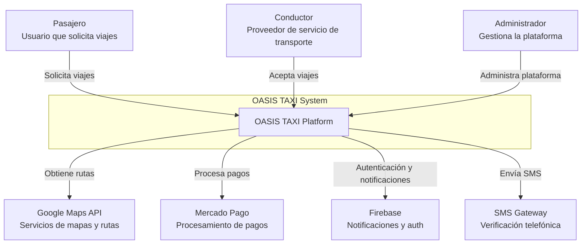
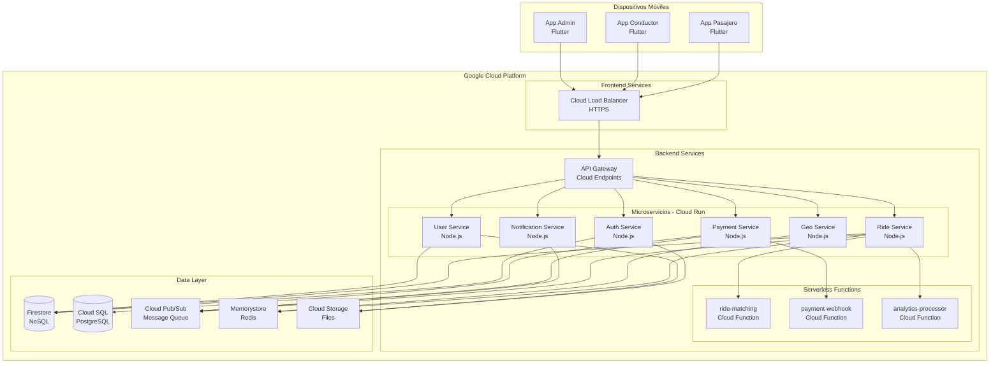
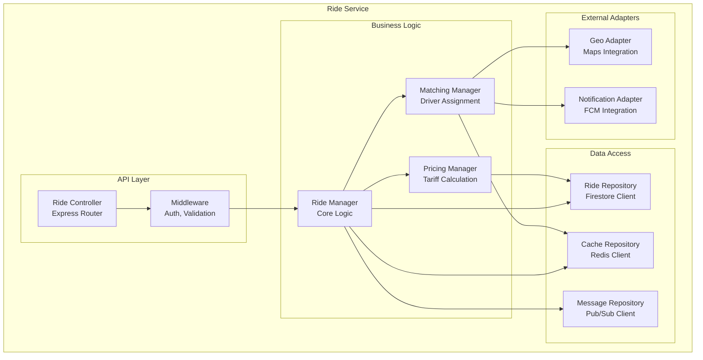

# Arquitectura OASIS TAXI - Modelo C4

## Nivel 1: Diagrama de Contexto



### Actores del Sistema

| Actor | Descripción | Interacciones Principales |
|-------|-------------|--------------------------|
| **Pasajero** | Usuario final que solicita servicios de transporte | Solicitar viaje, realizar pagos, calificar servicio |
| **Conductor** | Proveedor del servicio de transporte | Aceptar viajes, navegar rutas, recibir pagos |
| **Administrador** | Personal que gestiona la plataforma | Monitorear operaciones, gestionar tarifas, resolver incidencias |

### Sistemas Externos

| Sistema | Propósito | Integración |
|---------|-----------|-------------|
| **Google Maps API** | Geocodificación, rutas, navegación | REST API |
| **Mercado Pago** | Procesamiento de pagos | SDK + Webhooks |
| **Firebase** | Auth, FCM, Analytics | SDK nativo |
| **SMS Gateway** | Verificación telefónica | REST API |

## Nivel 2: Diagrama de Contenedores



### Descripción de Contenedores

#### Aplicaciones Móviles

| Contenedor | Tecnología | Responsabilidad |
|------------|-----------|-----------------|
| **App Pasajero** | Flutter 3, Dart | Interfaz para solicitar viajes, pagos, historial |
| **App Conductor** | Flutter 3, Dart | Interfaz para aceptar viajes, navegación, ganancias |
| **App Admin** | Flutter 3, Dart | Interfaz móvil para gestión y monitoreo |

#### Servicios Backend

| Servicio | Tecnología | Responsabilidad |
|----------|-----------|-----------------|
| **API Gateway** | Cloud Endpoints | Enrutamiento, rate limiting, autenticación |
| **Auth Service** | Node.js 20, Express | Registro, login, gestión de sesiones |
| **Ride Service** | Node.js 20, Express | Gestión de viajes, emparejamiento |
| **Payment Service** | Node.js 20, Express | Procesamiento de pagos, facturación |
| **Notification Service** | Node.js 20, Express | Envío de notificaciones push y SMS |
| **User Service** | Node.js 20, Express | Gestión de perfiles y documentos |
| **Geo Service** | Node.js 20, Express | Geocodificación, cálculo de rutas |

#### Funciones Serverless

| Función | Trigger | Propósito |
|---------|---------|-----------|
| **ride-matching** | Pub/Sub | Algoritmo de emparejamiento conductor-pasajero |
| **payment-webhook** | HTTP | Procesar webhooks de Mercado Pago |
| **analytics-processor** | Schedule | Procesamiento batch de analytics |

#### Almacenamiento

| Sistema | Tipo | Uso |
|---------|------|-----|
| **Firestore** | NoSQL | Datos en tiempo real, usuarios, viajes activos |
| **Cloud SQL** | PostgreSQL | Transacciones, reportes, datos históricos |
| **Cloud Pub/Sub** | Message Queue | Comunicación asíncrona entre servicios |
| **Memorystore** | Redis Cache | Caché de ubicaciones, sesiones |
| **Cloud Storage** | Object Storage | Fotos, documentos, backups |

## Nivel 3: Diagrama de Componentes - Ride Service



### Componentes del Ride Service

| Componente | Responsabilidad | Dependencias |
|------------|-----------------|--------------|
| **Ride Controller** | Manejo de requests HTTP | Express, Joi validation |
| **Middleware** | Autenticación, validación | JWT, Express middleware |
| **Ride Manager** | Lógica de negocio principal | Domain models |
| **Pricing Manager** | Cálculo de tarifas | Reglas de negocio |
| **Matching Manager** | Algoritmo de emparejamiento | Geo queries, ML model |
| **Ride Repository** | Acceso a datos de viajes | Firestore SDK |
| **Cache Repository** | Gestión de caché | Redis client |
| **Message Repository** | Mensajería asíncrona | Pub/Sub SDK |
| **Geo Adapter** | Integración con Maps | Google Maps client |
| **Notification Adapter** | Envío de notificaciones | FCM SDK |

## Nivel 4: Diagrama de Código - Ride Manager

```typescript
// Estructura del componente Ride Manager

interface RideManager {
    createRide(request: CreateRideRequest): Promise<Ride>
    acceptRide(rideId: string, driverId: string): Promise<Ride>
    startRide(rideId: string): Promise<Ride>
    completeRide(rideId: string): Promise<Ride>
    cancelRide(rideId: string, reason: string): Promise<Ride>
}

class RideManagerImpl implements RideManager {
    constructor(
        private rideRepository: RideRepository,
        private pricingManager: PricingManager,
        private matchingManager: MatchingManager,
        private notificationService: NotificationService,
        private eventBus: EventBus
    ) {}

    async createRide(request: CreateRideRequest): Promise<Ride> {
        // 1. Validar request
        this.validateRequest(request)
        
        // 2. Calcular precio estimado
        const pricing = await this.pricingManager.calculatePrice(
            request.pickup,
            request.destination
        )
        
        // 3. Crear ride en DB
        const ride = await this.rideRepository.create({
            passengerId: request.passengerId,
            pickup: request.pickup,
            destination: request.destination,
            estimatedPrice: pricing.total,
            status: RideStatus.PENDING
        })
        
        // 4. Buscar conductores cercanos
        await this.matchingManager.findDrivers(ride)
        
        // 5. Publicar evento
        await this.eventBus.publish('ride.created', ride)
        
        return ride
    }
    
    // ... otros métodos
}
```

## Decisiones de Arquitectura

### ADR-001: Microservicios vs Monolito

**Estado**: Aceptado

**Contexto**: Necesitamos una arquitectura que permita escalar independientemente diferentes partes del sistema.

**Decisión**: Adoptar arquitectura de microservicios con los siguientes servicios principales:
- Auth Service
- Ride Service  
- Payment Service
- Notification Service
- User Service
- Geo Service

**Consecuencias**:
- ✅ Escalamiento independiente
- ✅ Despliegues independientes
- ✅ Mejor tolerancia a fallos
- ❌ Mayor complejidad operacional
- ❌ Latencia adicional entre servicios

### ADR-002: Base de Datos - Firestore + PostgreSQL

**Estado**: Aceptado

**Contexto**: Necesitamos almacenamiento en tiempo real para datos activos y almacenamiento relacional para reportes.

**Decisión**: 
- Firestore para datos en tiempo real (viajes activos, ubicaciones)
- PostgreSQL para datos transaccionales y reportes

**Consecuencias**:
- ✅ Sincronización en tiempo real
- ✅ Consultas SQL complejas para reportes
- ❌ Complejidad de mantener dos sistemas
- ❌ Necesidad de sincronización de datos

### ADR-003: Flutter para las 3 Apps Móviles

**Estado**: Aceptado

**Contexto**: Necesitamos desarrollar 3 aplicaciones móviles manteniendo consistencia y reduciendo tiempo de desarrollo.

**Decisión**: Usar Flutter 3 para las tres aplicaciones (Pasajero, Conductor, Admin).

**Consecuencias**:
- ✅ Código compartido entre plataformas
- ✅ Consistencia de UI/UX
- ✅ Menor tiempo de desarrollo
- ✅ Un solo equipo de desarrollo
- ❌ Tamaño de app ligeramente mayor
- ❌ Dependencia del framework Flutter

## Patrones de Arquitectura

### 1. Event-Driven Architecture
- Uso de Cloud Pub/Sub para comunicación asíncrona
- Eventos para cambios de estado de viajes
- Desacoplamiento entre servicios

### 2. API Gateway Pattern
- Cloud Endpoints como punto único de entrada
- Rate limiting y autenticación centralizada
- Enrutamiento inteligente

### 3. Repository Pattern
- Abstracción de acceso a datos
- Facilita testing y cambios de DB
- Separación de lógica de negocio y datos

### 4. Circuit Breaker Pattern
- Protección contra fallos en cascada
- Fallbacks para servicios externos
- Monitoreo de salud de servicios

### 5. CQRS Light
- Separación de lecturas y escrituras
- Firestore para queries en tiempo real
- PostgreSQL para reportes complejos

## Consideraciones de Seguridad

### Autenticación y Autorización
- Firebase Auth para gestión de identidades
- JWT tokens con refresh tokens
- RBAC (Role-Based Access Control)

### Comunicación Segura
- HTTPS en todas las comunicaciones
- Certificate pinning en apps móviles
- Encriptación de datos sensibles

### Protección de APIs
- Rate limiting por usuario
- API keys para servicios externos
- Validación de input exhaustiva

### Cumplimiento
- GDPR compliance para datos personales
- PCI DSS para procesamiento de pagos
- Logs de auditoría completos

---

Este documento establece la arquitectura técnica de OASIS TAXI siguiendo el modelo C4, proporcionando una visión clara desde el contexto general hasta los detalles de implementación.