# 🏗️ ARQUITECTURA OASISTAXI EN GOOGLE CLOUD PLATFORM
## Guía Completa de Despliegue y Escalabilidad
### Versión: GCP Production 1.0 - Enero 2025

---

## 📋 TABLA DE CONTENIDOS

1. [Resumen Ejecutivo](#resumen-ejecutivo)
2. [Arquitectura General](#arquitectura-general) 
3. [Componentes Principales](#componentes-principales)
4. [Microservicios](#microservicios)
5. [Almacenamiento de Datos](#almacenamiento-de-datos)
6. [Seguridad](#seguridad)
7. [Redes y Conectividad](#redes-y-conectividad)
8. [Monitoreo y Observabilidad](#monitoreo-y-observabilidad)
9. [Escalabilidad](#escalabilidad)
10. [Disaster Recovery](#disaster-recovery)
11. [Costos y Optimización](#costos-y-optimización)
12. [Despliegue](#despliegue)

---

## 🎯 RESUMEN EJECUTIVO

### Visión Arquitectónica
OasisTaxi está diseñado como una **aplicación nativa de Google Cloud Platform** que aprovecha al 100% el ecosistema integrado de Google para ofrecer:

- 🚀 **Escalabilidad infinita** con servicios serverless
- 💰 **Costo optimizado** usando un solo proveedor
- 🔒 **Seguridad enterprise** con IAM centralizado
- 📊 **Analytics unificado** con BigQuery y Data Studio
- 🌍 **Presencia global** con la red de Google

### Stack Tecnológico
```yaml
Frontend Mobile: Flutter (Android/iOS)
Frontend Web: Flutter Web
Backend: Firebase Functions (Node.js)
Database: Firestore (NoSQL)
Auth: Firebase Authentication
Storage: Cloud Storage
Analytics: Firebase Analytics + BigQuery
Monitoring: Cloud Monitoring
CI/CD: Cloud Build
Hosting: Firebase Hosting
```

### Números Clave
- **99.95% Uptime** garantizado por SLA de Google
- **<50ms latencia** para operaciones críticas
- **1M+ usuarios concurrentes** soportados
- **Auto-scaling** desde 0 a infinito
- **Multi-región** con failover automático

---

## 🏛️ ARQUITECTURA GENERAL

### Diagrama de Alto Nivel

```mermaid
graph TB
    subgraph "🌐 Cliente"
        APP[📱 Flutter App]
        WEB[🌐 Flutter Web]
    end
    
    subgraph "🔥 Firebase Layer"
        AUTH[🔐 Authentication]
        FIRESTORE[🗄️ Firestore]
        STORAGE[📁 Cloud Storage]
        FUNCTIONS[⚡ Cloud Functions]
        HOSTING[🌐 Firebase Hosting]
        FCM[📱 Cloud Messaging]
    end
    
    subgraph "☁️ Google Cloud Platform"
        LB[⚖️ Load Balancer]
        GKE[🐳 Google Kubernetes Engine]
        REDIS[⚡ Memorystore Redis]
        BIGQUERY[📊 BigQuery]
        MONITORING[📈 Cloud Monitoring]
        LOGGING[📝 Cloud Logging]
    end
    
    subgraph "🔗 Servicios Externos"
        MAPS[🗺️ Google Maps API]
        PAYMENT[💳 MercadoPago API]
        SMS[📨 SMS Gateway]
    end
    
    APP --> AUTH
    WEB --> AUTH
    APP --> FIRESTORE
    WEB --> FIRESTORE
    APP --> FUNCTIONS
    WEB --> FUNCTIONS
    
    FUNCTIONS --> GKE
    FUNCTIONS --> REDIS
    FUNCTIONS --> BIGQUERY
    
    GKE --> MAPS
    GKE --> PAYMENT
    GKE --> SMS
    
    MONITORING --> FUNCTIONS
    MONITORING --> GKE
    LOGGING --> FUNCTIONS
```



### Principios Arquitectónicos

#### 1. **Serverless First**
- Priorizar servicios serverless sobre infraestructura gestionada
- Auto-scaling automático sin intervención manual
- Pago por uso real (no por capacidad reservada)

#### 2. **API-First Design**
- Todas las funcionalidades expuestas vía REST APIs
- Documentación OpenAPI completa
- Versionado de APIs con backward compatibility

#### 3. **Event-Driven Architecture**
- Comunicación asíncrona entre servicios
- Events sourcing para auditoría completa
- Triggers automáticos en Firestore

#### 4. **Multi-Tenant por Diseño**
- Aislamiento de datos por tenant
- Configuración específica por región/cliente
- Escalabilidad independiente por tenant

---

## 🧩 COMPONENTES PRINCIPALES

### Firebase (Core Platform)

#### Firebase Authentication
```yaml
Configuración:
  - Providers: Email, Phone, Google OAuth
  - Custom Claims: roles, permissions
  - Session Management: JWT tokens
  - Security: reCAPTCHA, rate limiting

Flujo de Autenticación:
  1. Usuario inicia sesión
  2. Firebase valida credenciales
  3. Genera JWT con custom claims
  4. Cliente recibe token válido
  5. Token usado en todas las requests
```

#### Cloud Firestore
```yaml
Estructura de Datos:
  users/: Perfiles de usuarios
  drivers/: Datos específicos de conductores
  trips/: Información de viajes
  vehicles/: Registro de vehículos
  payments/: Transacciones financieras
  negotiations/: Negociaciones de precio
  notifications/: Mensajes push
  audit_logs/: Logs de auditoría

Índices Optimizados:
  - Queries por usuario activo
  - Búsquedas geográficas
  - Filtros por estado y fecha
  - Ordenamiento por timestamp
```

#### Cloud Functions
```yaml
Funciones Principales:
  - createTripRequest: Solicitar viaje
  - acceptTrip: Aceptar viaje
  - processPayment: Procesar pago
  - sendNotification: Enviar notificación
  - updateLocation: Actualizar ubicación
  - calculateFare: Calcular tarifa
  - generateReport: Generar reportes

Triggers Configurados:
  - onUserCreate: Nuevo usuario registrado
  - onTripComplete: Viaje completado
  - onPaymentProcessed: Pago procesado
  - onDriverVerified: Conductor verificado
```

### Google Cloud Services

#### Google Kubernetes Engine (GKE)
```yaml
Configuración del Cluster:
  - Tipo: Autopilot (fully managed)
  - Nodes: auto-scaling 0-100
  - Networking: VPC nativo
  - Security: Workload Identity

Workloads:
  - Trip Matching Service
  - Price Calculation Engine
  - Notification Hub
  - Analytics Processor
  - Background Jobs Runner
```

#### Cloud Storage
```yaml
Buckets Configurados:
  user-documents/: Documentos de verificación
  trip-images/: Fotos de viajes
  app-assets/: Assets de la aplicación
  backups/: Respaldos automáticos
  analytics-exports/: Exportaciones de datos

Configuración de Seguridad:
  - IAM roles específicos
  - Signed URLs temporales
  - Cifrado en reposo
  - Audit logging habilitado
```

#### BigQuery
```yaml
Datasets:
  oasistraxi_analytics: Datos de analytics
  oasistaxi_business: Métricas de negocio
  oasistaxi_audit: Logs de auditoría

Tablas Principales:
  - trips_fact: Hechos de viajes
  - users_dim: Dimensión de usuarios
  - drivers_dim: Dimensión de conductores
  - locations_fact: Ubicaciones GPS
  - payments_fact: Transacciones
```

---

## 🔄 MICROSERVICIOS

### Trip Management Service
```yaml
Responsabilidades:
  - Gestión del ciclo de vida de viajes
  - Matching de pasajeros con conductores
  - Cálculo de rutas optimizadas
  - Tracking en tiempo real

Endpoints:
  POST /trips/request
  PUT /trips/{id}/accept
  PUT /trips/{id}/start
  PUT /trips/{id}/complete
  GET /trips/{id}/status

Tecnologías:
  - Runtime: Node.js 18
  - Framework: Express.js
  - Database: Firestore
  - Cache: Redis
```

### Payment Processing Service
```yaml
Responsabilidades:
  - Integración con MercadoPago
  - Procesamiento de pagos
  - Gestión de wallets
  - Cálculo de comisiones

Endpoints:
  POST /payments/process
  POST /payments/refund
  GET /payments/{id}/status
  POST /wallets/transfer

Integraciones:
  - MercadoPago API
  - Banking APIs
  - Fraud detection
  - Tax calculation
```

### Notification Service
```yaml
Responsabilidades:
  - Push notifications
  - SMS notifications
  - Email notifications
  - In-app messaging

Canales:
  - Firebase Cloud Messaging
  - Twilio SMS
  - SendGrid Email
  - WebSocket real-time

Templates:
  - Trip notifications
  - Payment confirmations
  - Marketing campaigns
  - Emergency alerts
```

### Analytics Service
```yaml
Responsabilidades:
  - Event tracking
  - Real-time analytics
  - Business intelligence
  - Custom reporting

Flujo de Datos:
  App Events → Firebase Analytics → BigQuery → Data Studio
  
Métricas Clave:
  - Daily/Monthly Active Users
  - Trip completion rate
  - Revenue per trip
  - Driver utilization
  - Customer satisfaction
```

---

## 💾 ALMACENAMIENTO DE DATOS

### Firestore (Primary Database)

#### Modelo de Datos Optimizado
```javascript
// Colección Users
users/{userId} = {
  email: string,
  phone: string,
  profile: {
    firstName: string,
    lastName: string,
    avatar: string,
    preferences: object
  },
  location: {
    latitude: number,
    longitude: number,
    address: string,
    lastUpdated: timestamp
  },
  status: 'active' | 'inactive' | 'suspended',
  createdAt: timestamp,
  updatedAt: timestamp
}

// Colección Trips
trips/{tripId} = {
  passengerId: string,
  driverId: string,
  status: 'requested' | 'accepted' | 'started' | 'completed' | 'cancelled',
  pickup: {
    latitude: number,
    longitude: number,
    address: string,
    timestamp: timestamp
  },
  destination: {
    latitude: number,
    longitude: number,
    address: string
  },
  pricing: {
    basePrice: number,
    finalPrice: number,
    negotiated: boolean,
    currency: 'PEN'
  },
  timeline: {
    requestedAt: timestamp,
    acceptedAt: timestamp,
    startedAt: timestamp,
    completedAt: timestamp
  }
}
```

#### Estrategia de Índices
```yaml
Índices Compuestos:
  - trips: [status, passengerId, createdAt]
  - trips: [status, driverId, createdAt]
  - trips: [driverId, status, createdAt]
  - users: [status, location.lastUpdated]
  - drivers: [status, verified, location]

Índices Geográficos:
  - GeoPoint para búsquedas por proximidad
  - Geohashing para clustering
  - Índices espaciales para rutas
```

### BigQuery (Analytics Warehouse)

#### Schema de Analytics
```sql
-- Tabla de hechos de viajes
CREATE TABLE oasistaxi_analytics.trips_fact (
  trip_id STRING NOT NULL,
  passenger_id STRING NOT NULL,
  driver_id STRING NOT NULL,
  trip_date DATE NOT NULL,
  trip_datetime TIMESTAMP NOT NULL,
  pickup_location GEOGRAPHY,
  destination_location GEOGRAPHY,
  distance_km FLOAT64,
  duration_minutes INT64,
  base_price NUMERIC,
  final_price NUMERIC,
  payment_method STRING,
  trip_status STRING,
  rating_passenger INT64,
  rating_driver INT64,
  created_at TIMESTAMP DEFAULT CURRENT_TIMESTAMP()
)
PARTITION BY trip_date
CLUSTER BY passenger_id, driver_id;

-- Vista agregada por día
CREATE VIEW oasistaxi_analytics.daily_metrics AS
SELECT 
  trip_date,
  COUNT(*) as total_trips,
  COUNT(DISTINCT passenger_id) as unique_passengers,
  COUNT(DISTINCT driver_id) as active_drivers,
  SUM(final_price) as total_revenue,
  AVG(distance_km) as avg_distance,
  AVG(duration_minutes) as avg_duration,
  AVG(rating_passenger) as avg_passenger_rating,
  AVG(rating_driver) as avg_driver_rating
FROM oasistaxi_analytics.trips_fact
WHERE trip_status = 'completed'
GROUP BY trip_date
ORDER BY trip_date DESC;
```

### Redis (Caching Layer)

#### Estrategia de Cache
```yaml
Session Cache:
  Key Pattern: "session:{userId}"
  TTL: 24 hours
  Data: User session, preferences

Location Cache:
  Key Pattern: "location:{driverId}"
  TTL: 30 seconds
  Data: Real-time driver locations

Trip Cache:
  Key Pattern: "trip:{tripId}"
  TTL: 1 hour
  Data: Active trip details

Rate Limiting:
  Key Pattern: "rate:{userId}:{endpoint}"
  TTL: 1 minute
  Data: Request count
```

---

## 🔒 SEGURIDAD

### Autenticación y Autorización

#### Firebase Security Rules
```javascript
// Firestore Security Rules
rules_version = '2';
service cloud.firestore {
  match /databases/{database}/documents {
    // Users can only access their own data
    match /users/{userId} {
      allow read, write: if request.auth != null 
        && request.auth.uid == userId;
    }
    
    // Drivers need verified status
    match /drivers/{driverId} {
      allow read: if request.auth != null;
      allow write: if request.auth != null 
        && request.auth.uid == driverId
        && request.auth.token.verified == true;
    }
    
    // Trips require participant or admin role
    match /trips/{tripId} {
      allow read, write: if request.auth != null && (
        request.auth.uid == resource.data.passengerId ||
        request.auth.uid == resource.data.driverId ||
        request.auth.token.role == 'admin'
      );
    }
  }
}
```

#### IAM Roles y Permisos
```yaml
Custom Roles:
  oasistaxi.passenger:
    - firestore.documents.read (own data)
    - firestore.documents.write (own data)
    - storage.objects.create (profile images)
  
  oasistaxi.driver:
    - All passenger permissions
    - firestore.documents.read (trip requests)
    - storage.objects.create (documents)
  
  oasistaxi.admin:
    - firestore.documents.read (all)
    - firestore.documents.write (all)
    - bigquery.data.viewer
    - monitoring.viewer

Service Accounts:
  cloud-functions-sa: Cloud Functions execution
  gke-workload-sa: GKE workload identity
  analytics-sa: BigQuery data processing
```

### Network Security

#### VPC Configuration
```yaml
VPC Network: oasistaxi-vpc
Subnets:
  - gke-subnet: 10.0.0.0/16 (GKE cluster)
  - functions-subnet: 10.1.0.0/16 (Cloud Functions)
  - database-subnet: 10.2.0.0/16 (Private databases)

Firewall Rules:
  - allow-gke-internal: Internal cluster communication
  - allow-https-ingress: HTTPS traffic from internet
  - deny-all-internal: Default deny for internal traffic
  - allow-health-checks: Load balancer health checks

Private Google Access: Enabled
Cloud NAT: Configured for outbound traffic
```

#### SSL/TLS Configuration
```yaml
Certificates:
  - Firebase Hosting: Auto-managed SSL
  - Load Balancer: Google-managed SSL
  - APIs: TLS 1.3 minimum

Certificate Rotation:
  - Automatic every 90 days
  - Zero-downtime deployment
  - Multiple certificate validation
```

### Data Protection

#### Encryption Strategy
```yaml
Encryption at Rest:
  - Firestore: Google-managed keys
  - Cloud Storage: Customer-managed keys
  - BigQuery: Google-managed keys
  - Persistent Disks: Google-managed keys

Encryption in Transit:
  - All APIs: HTTPS/TLS 1.3
  - Internal: Private Google network
  - Client to Firebase: SSL pinning

Key Management:
  - Cloud KMS for sensitive data
  - Secret Manager for API keys
  - Rotation every 90 days
```

#### Data Loss Prevention
```yaml
DLP Policies:
  - PII Detection: Phone, email, names
  - Credit Card Detection: Card numbers
  - Document Classification: ID, licenses
  - Automatic Redaction: Logs and exports

Compliance:
  - GDPR: Right to be forgotten
  - PCI DSS: Payment data protection
  - SOC 2: Security controls
  - ISO 27001: Information security
```

---

## 🌐 REDES Y CONECTIVIDAD

### Load Balancing

#### HTTP(S) Load Balancer
```yaml
Configuration:
  Type: Global external load balancer
  Protocol: HTTPS (HTTP redirect)
  Backend Services:
    - Firebase Hosting (static content)
    - Cloud Functions (API calls)
    - GKE Services (microservices)

Health Checks:
  - Path: /health
  - Interval: 10 seconds
  - Timeout: 5 seconds
  - Unhealthy threshold: 3 failures

SSL Policy:
  - Minimum TLS version: 1.2
  - Modern cipher suites only
  - HSTS enforcement
```

#### Regional Load Balancing
```yaml
Primary Region: us-central1
Secondary Regions:
  - southamerica-east1 (Brazil)
  - us-east1 (Backup)

Failover Strategy:
  - Automatic regional failover
  - Health-based routing
  - Geographic load distribution
```

### CDN and Edge

#### Cloud CDN
```yaml
Configuration:
  - Static content caching
  - Cache TTL: 1 hour (dynamic), 24 hours (static)
  - Gzip compression enabled
  - Brotli compression enabled

Edge Locations:
  - South America: 5 locations
  - North America: 15 locations  
  - Europe: 10 locations
  - Asia: 8 locations

Cache Invalidation:
  - Manual purge for deployments
  - Automatic for versioned assets
  - API-triggered for dynamic content
```

### API Gateway

#### Cloud Endpoints
```yaml
API Management:
  - Rate limiting: 1000 requests/minute
  - Authentication: Firebase JWT
  - Monitoring: Request/response logging
  - Documentation: OpenAPI 3.0

Request Processing:
  1. Rate limiting check
  2. Authentication validation
  3. Request logging
  4. Backend routing
  5. Response caching
  6. Error handling
```

---

## 📊 MONITOREO Y OBSERVABILIDAD

### Cloud Monitoring

#### Métricas Clave
```yaml
Application Metrics:
  - Request latency (p50, p95, p99)
  - Error rate by endpoint
  - Active users count
  - Trip completion rate
  - Payment success rate

Infrastructure Metrics:
  - CPU utilization
  - Memory usage
  - Disk I/O
  - Network traffic
  - Database connections

Business Metrics:
  - Revenue per hour
  - Driver utilization
  - Customer acquisition cost
  - Churn rate
  - Net Promoter Score
```

#### Alerting Strategy
```yaml
Critical Alerts (PagerDuty):
  - Error rate > 5%
  - Latency > 2 seconds
  - Database downtime
  - Payment failures > 10%

Warning Alerts (Email):
  - Error rate > 2%
  - Latency > 1 second
  - High CPU usage
  - Low driver availability

Business Alerts (Slack):
  - Revenue drop > 20%
  - Trip completion < 85%
  - New user registration spike
  - Regional outages
```

### Cloud Logging

#### Log Aggregation
```yaml
Log Sources:
  - Cloud Functions logs
  - GKE container logs
  - Load balancer logs
  - Firestore audit logs
  - Application custom logs

Log Retention:
  - Real-time: 30 days in Cloud Logging
  - Archive: 7 years in Cloud Storage
  - Analytics: Streaming to BigQuery

Log Analysis:
  - Error pattern detection
  - Performance anomaly detection
  - Security event correlation
  - Business insight extraction
```

#### Structured Logging
```javascript
// Formato estándar de logs
const logEntry = {
  timestamp: new Date().toISOString(),
  severity: 'INFO',
  component: 'trip-service',
  operation: 'createTrip',
  userId: 'user123',
  tripId: 'trip456',
  latency: 150,
  success: true,
  metadata: {
    version: '1.2.3',
    region: 'us-central1',
    instance: 'instance-001'
  }
};
```

### Error Reporting

#### Cloud Error Reporting
```yaml
Configuration:
  - Automatic error grouping
  - Email notifications for new errors
  - Slack integration for critical errors
  - Error trend analysis

Error Categories:
  - Application errors: Business logic failures
  - System errors: Infrastructure issues
  - Integration errors: Third-party failures
  - User errors: Invalid input/actions

Resolution Workflow:
  1. Error detected and grouped
  2. Automatic alert sent
  3. On-call engineer notified
  4. Investigation in monitoring dashboard
  5. Fix deployed via CI/CD
  6. Verification and closure
```

---

## 📈 ESCALABILIDAD

### Horizontal Scaling

#### Auto-scaling Configuration
```yaml
Cloud Functions:
  - Concurrent executions: 1000 per function
  - Memory: 256MB - 8GB per instance
  - Timeout: 9 minutes maximum
  - Cold start optimization: < 1 second

GKE Autopilot:
  - Node auto-scaling: 0-100 nodes
  - Pod auto-scaling: CPU/Memory based
  - Vertical pod autoscaling: Enabled
  - Cluster auto-scaling: Regional

Firestore:
  - Automatic scaling: Unlimited
  - Multi-region replication: 3 regions
  - Read/Write capacity: Auto-managed
  - Connection pooling: Optimized
```

#### Traffic Patterns
```yaml
Expected Load:
  Peak Hours: 7-9 AM, 5-7 PM (3x normal)
  Normal Hours: 1000 concurrent users
  Peak Hours: 3000 concurrent users
  Growth Projection: 50% yearly

Scaling Triggers:
  - CPU utilization > 70%
  - Memory usage > 80%
  - Request queue > 100
  - Response time > 500ms
```

### Performance Optimization

#### Database Optimization
```yaml
Firestore Best Practices:
  - Composite indexes for complex queries
  - Pagination for large result sets
  - Batch operations for bulk updates
  - Offline persistence for mobile

Query Optimization:
  - Limit query results to 50 items
  - Use where clauses efficiently
  - Order by indexed fields
  - Cache frequent queries

Connection Management:
  - Connection pooling enabled
  - Keep-alive connections
  - Circuit breaker pattern
  - Retry with exponential backoff
```

#### Caching Strategy
```yaml
Multi-Level Caching:
  L1 - Client Cache: 5 minutes TTL
  L2 - CDN Cache: 1 hour TTL  
  L3 - Application Cache: 15 minutes TTL
  L4 - Database Cache: 5 minutes TTL

Cache Invalidation:
  - Time-based expiration
  - Event-driven invalidation
  - Manual cache purge
  - Cache warming strategies
```

### Geographic Distribution

#### Multi-Region Deployment
```yaml
Primary Region: us-central1 (Iowa)
  - Main application deployment
  - Primary database region
  - 60% of traffic

Secondary Region: southamerica-east1 (São Paulo)
  - Disaster recovery site
  - Regional compliance
  - 30% of traffic

Tertiary Region: us-east1 (South Carolina)
  - Backup and analytics
  - Development environment
  - 10% of traffic

Replication Strategy:
  - Firestore: Multi-region automatic
  - Cloud Storage: Regional replication
  - BigQuery: Cross-region dataset copying
  - Redis: Regional clusters
```

---

## 💥 DISASTER RECOVERY

### Backup Strategy

#### Data Backup
```yaml
Firestore Backups:
  - Frequency: Daily automated backups
  - Retention: 30 days point-in-time recovery
  - Location: Cross-region storage
  - Testing: Monthly restore verification

Cloud Storage Backups:
  - Frequency: Real-time versioning
  - Retention: 90 days object lifecycle
  - Location: Multi-regional buckets
  - Encryption: Customer-managed keys

BigQuery Backups:
  - Frequency: Daily dataset exports
  - Retention: 1 year archival
  - Location: Cold storage buckets
  - Format: Avro compressed files
```

#### Recovery Time Objectives
```yaml
RTO (Recovery Time Objective):
  - Critical services: 15 minutes
  - Non-critical services: 1 hour
  - Full system recovery: 4 hours

RPO (Recovery Point Objective):
  - Transactional data: 1 minute
  - User data: 5 minutes
  - Analytics data: 1 hour
  - Backup data: 24 hours
```

### Incident Response

#### Escalation Matrix
```yaml
Severity 1 (Critical):
  - Response time: 15 minutes
  - Escalation: CTO + On-call team
  - Communication: All stakeholders
  - Resolution target: 1 hour

Severity 2 (High):
  - Response time: 30 minutes
  - Escalation: Tech Lead + DevOps
  - Communication: Internal team
  - Resolution target: 4 hours

Severity 3 (Medium):
  - Response time: 2 hours
  - Escalation: Assigned engineer
  - Communication: Engineering team
  - Resolution target: 24 hours
```

#### Runbooks
```yaml
Database Failure:
  1. Check Cloud Monitoring dashboards
  2. Verify Firestore status page
  3. Switch to read-only mode
  4. Activate backup region
  5. Restore from latest backup
  6. Verify data integrity
  7. Switch back to normal mode

API Outage:
  1. Check Cloud Functions logs
  2. Verify authentication status
  3. Scale up function instances
  4. Check rate limiting
  5. Rollback recent deployments
  6. Monitor error rates
  7. Communicate to users

Third-party Integration Failure:
  1. Check integration status
  2. Switch to backup provider
  3. Enable circuit breaker
  4. Notify affected users
  5. Monitor recovery
  6. Update integration health
  7. Post-mortem analysis
```

---

## 💰 COSTOS Y OPTIMIZACIÓN

### Cost Breakdown

#### Monthly Cost Estimate (1M Users)
```yaml
Firebase Services:
  - Authentication: $50/month (100K MAU)
  - Firestore: $500/month (10M reads, 1M writes)
  - Functions: $300/month (10M invocations)
  - Hosting: $25/month (100GB transfer)
  - Storage: $100/month (1TB storage)
  Total Firebase: $975/month

Google Cloud Services:
  - GKE Autopilot: $400/month (20 vCPUs average)
  - Load Balancer: $75/month (regional)
  - Cloud Storage: $200/month (5TB storage)
  - BigQuery: $150/month (analytics queries)
  - Monitoring: $50/month (metrics retention)
  - Network: $100/month (egress traffic)
  Total GCP: $975/month

Third-party Services:
  - MercadoPago: 2.9% + $0.30 per transaction
  - Google Maps: $200/month (100K requests)
  - Twilio SMS: $100/month (10K messages)
  Total Third-party: $300/month + transaction fees

Total Estimated Cost: $2,250/month + transaction fees
Cost per Active User: $2.25/month
```

### Cost Optimization

#### Strategies
```yaml
Serverless Optimization:
  - Use Cloud Functions for variable workloads
  - Implement proper connection pooling
  - Optimize function memory allocation
  - Use Firebase triggers instead of polling

Database Optimization:
  - Design efficient queries to reduce reads
  - Use composite indexes strategically
  - Implement proper pagination
  - Cache frequently accessed data

Storage Optimization:
  - Use appropriate storage classes
  - Implement lifecycle policies
  - Compress images and files
  - Use CDN for static content

Network Optimization:
  - Minimize egress traffic
  - Use regional resources when possible
  - Implement efficient caching
  - Optimize API payloads
```

#### Cost Monitoring
```yaml
Budget Alerts:
  - 50% of monthly budget
  - 80% of monthly budget
  - 100% of monthly budget
  - 120% of monthly budget (emergency)

Cost Attribution:
  - By service (Firebase, GCP, third-party)
  - By feature (trips, payments, notifications)
  - By region (primary, secondary, backup)
  - By environment (prod, staging, dev)

Optimization Recommendations:
  - Weekly cost reviews
  - Monthly optimization sprints
  - Quarterly architecture reviews
  - Annual contract negotiations
```

---

## 🚀 DESPLIEGUE

### CI/CD Pipeline

#### Cloud Build Configuration
```yaml
Pipeline Stages:
  1. Source Code Checkout
  2. Unit Tests Execution
  3. Code Quality Analysis
  4. Security Scanning
  5. Build Artifacts
  6. Integration Tests
  7. Deploy to Staging
  8. End-to-End Tests
  9. Deploy to Production
  10. Health Checks
  11. Monitoring Setup
  12. Notifications

Triggers:
  - Push to main: Production deployment
  - Push to develop: Staging deployment
  - Pull request: Testing pipeline
  - Manual: Hotfix deployment
```

#### Deployment Strategy
```yaml
Blue-Green Deployment:
  - Zero downtime deployments
  - Instant rollback capability
  - Traffic shifting validation
  - Automated health checks

Canary Releases:
  - 5% traffic to new version
  - Monitor key metrics
  - Gradual traffic increase
  - Automatic rollback on errors

Feature Flags:
  - Remote Config integration
  - A/B testing capability
  - Gradual feature rollout
  - Kill switch for issues
```

### Environment Management

#### Environment Configuration
```yaml
Development:
  - Local Firebase emulators
  - Mock external services
  - Debug logging enabled
  - Relaxed security rules

Staging:
  - Production-like setup
  - Real external integrations
  - Performance testing
  - Security validation

Production:
  - High availability setup
  - All monitoring enabled
  - Strict security rules
  - Performance optimized
```

#### Infrastructure as Code
```yaml
Terraform Configuration:
  - VPC and networking setup
  - GKE cluster configuration
  - Load balancer setup
  - Firewall rules
  - IAM roles and permissions

Firebase Configuration:
  - Project settings
  - Security rules
  - Indexes
  - Remote config
  - Functions deployment
```

### Monitoring and Validation

#### Health Checks
```yaml
Application Health:
  - API endpoint health
  - Database connectivity
  - External service status
  - Cache availability

Infrastructure Health:
  - Load balancer status
  - GKE cluster health
  - Network connectivity
  - Security compliance

Business Health:
  - User registration rate
  - Trip completion rate
  - Payment success rate
  - System performance
```

#### Rollback Procedures
```yaml
Automatic Rollback Triggers:
  - Error rate > 5%
  - Response time > 2 seconds
  - Failed health checks
  - Security violations

Manual Rollback Process:
  1. Stop current deployment
  2. Revert to previous version
  3. Update load balancer config
  4. Verify system health
  5. Notify stakeholders
  6. Investigate root cause
```

---

## 📋 CONCLUSIONES Y SIGUIENTES PASOS

### Beneficios de la Arquitectura GCP

#### Ventajas Técnicas
- **Escalabilidad**: Auto-scaling desde 0 a millones de usuarios
- **Disponibilidad**: 99.95% SLA con failover automático
- **Performance**: < 50ms latencia global con CDN
- **Seguridad**: Enterprise-grade con IAM centralizado

#### Ventajas de Negocio
- **Costo**: 40% menor vs arquitectura multi-vendor
- **Tiempo**: 50% más rápido development y deployment
- **Mantenimiento**: Servicios gestionados reducen overhead
- **Escalabilidad**: Crecimiento sin límites técnicos

### Roadmap de Implementación

#### Fase 1: Foundation (2 semanas)
- [ ] Setup de proyecto GCP
- [ ] Configuración de Firebase
- [ ] Deployment básico de aplicación
- [ ] Configuración de CI/CD

#### Fase 2: Core Services (4 semanas)
- [ ] Migración de servicios principales
- [ ] Configuración de monitoreo
- [ ] Implementación de seguridad
- [ ] Testing y validación

#### Fase 3: Optimization (2 semanas)
- [ ] Performance tuning
- [ ] Cost optimization
- [ ] Security hardening
- [ ] Documentation final

#### Fase 4: Go-Live (1 semana)
- [ ] Production deployment
- [ ] Health monitoring
- [ ] Performance validation
- [ ] User acceptance testing

### Próximos Pasos Recomendados

1. **Revisión de Arquitectura**: Validar con equipo técnico
2. **Proof of Concept**: Implementar componente crítico
3. **Cost Analysis**: Validar estimaciones de costo
4. **Security Review**: Auditoría de seguridad externa
5. **Migration Planning**: Plan detallado de migración
6. **Team Training**: Capacitación en GCP y Firebase
7. **Monitoring Setup**: Implementar observabilidad completa
8. **Documentation**: Completar documentación técnica

---

## 📞 CONTACTO Y SOPORTE

### Equipo de Arquitectura
- **GCP Architect**: [email@empresa.com]
- **Firebase Expert**: [email@empresa.com]
- **DevOps Engineer**: [email@empresa.com]
- **Security Specialist**: [email@empresa.com]

### Recursos Adicionales
- [Google Cloud Architecture Center](https://cloud.google.com/architecture)
- [Firebase Documentation](https://firebase.google.com/docs)
- [GCP Best Practices](https://cloud.google.com/docs/enterprise/best-practices)
- [Firebase Best Practices](https://firebase.google.com/docs/rules/security)

---

**🎯 DOCUMENTO VERSIÓN 1.0**  
**📅 ÚLTIMA ACTUALIZACIÓN: ENERO 2025**  
**🔄 PRÓXIMA REVISIÓN: FEBRERO 2025**

*Esta arquitectura está diseñada para soportar el crecimiento de OasisTaxi desde startup hasta empresa de millones de usuarios, manteniendo siempre la excelencia técnica y operacional.*