# 🏗️ DIAGRAMAS DE ARQUITECTURA - OASISTAXI PERÚ

## 📊 ARQUITECTURA GENERAL DEL SISTEMA

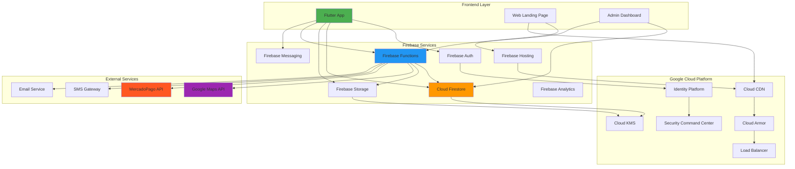

## 🔄 FLUJO DE DATOS PRINCIPAL

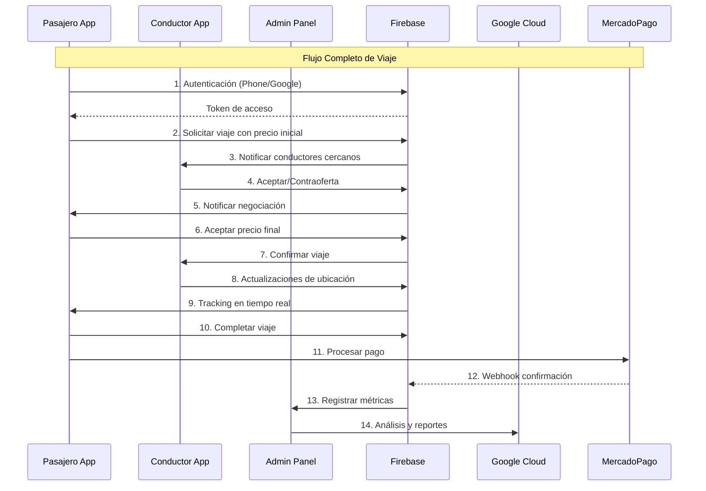

## 🎯 ARQUITECTURA POR CAPAS

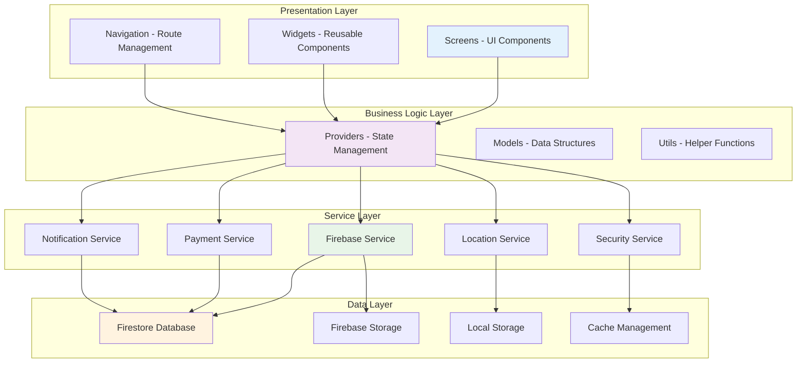

## 🔐 ARQUITECTURA DE SEGURIDAD

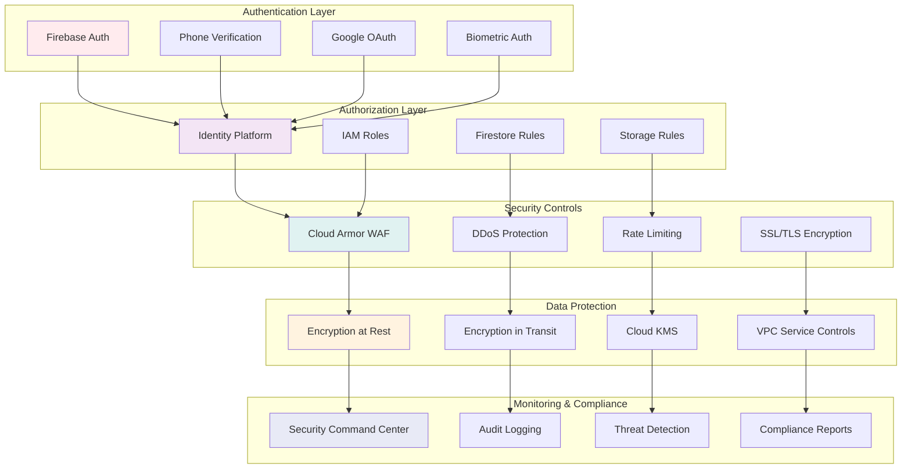

## 🚗 FLUJO DE NEGOCIACIÓN DE PRECIOS

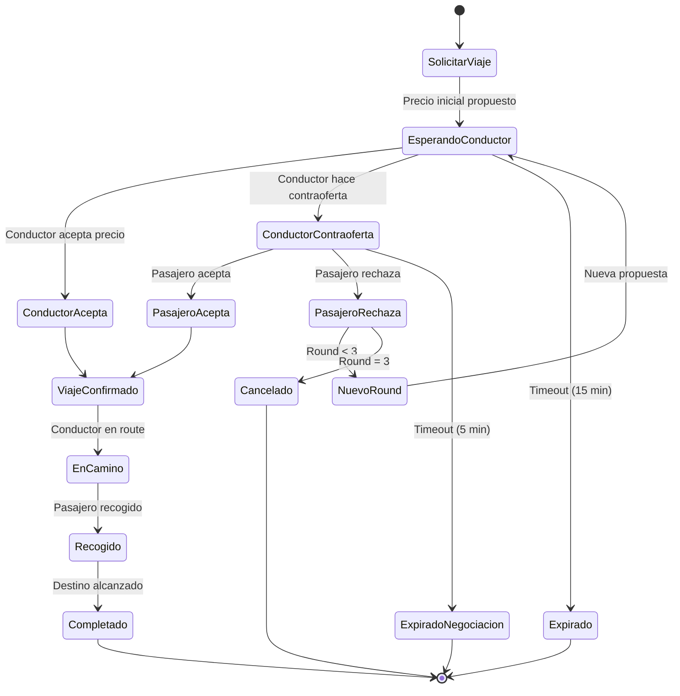

## 📱 ARQUITECTURA MÓVIL

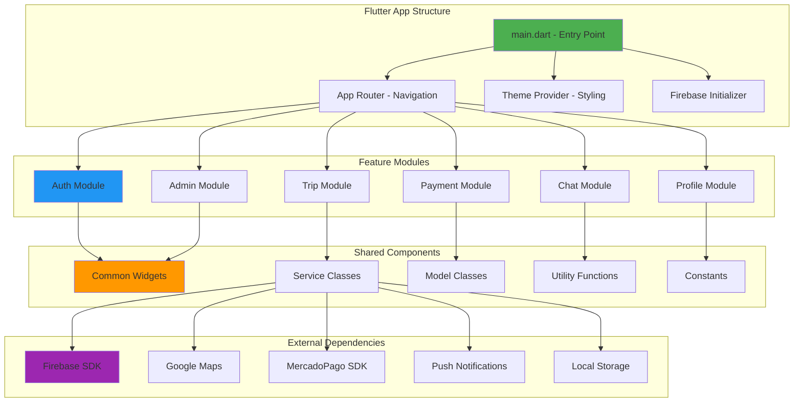

## 🔄 ARQUITECTURA DE MICROSERVICIOS

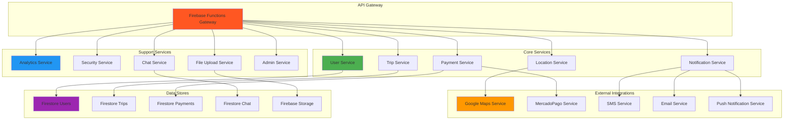

## 🗄️ MODELO DE DATOS FIRESTORE

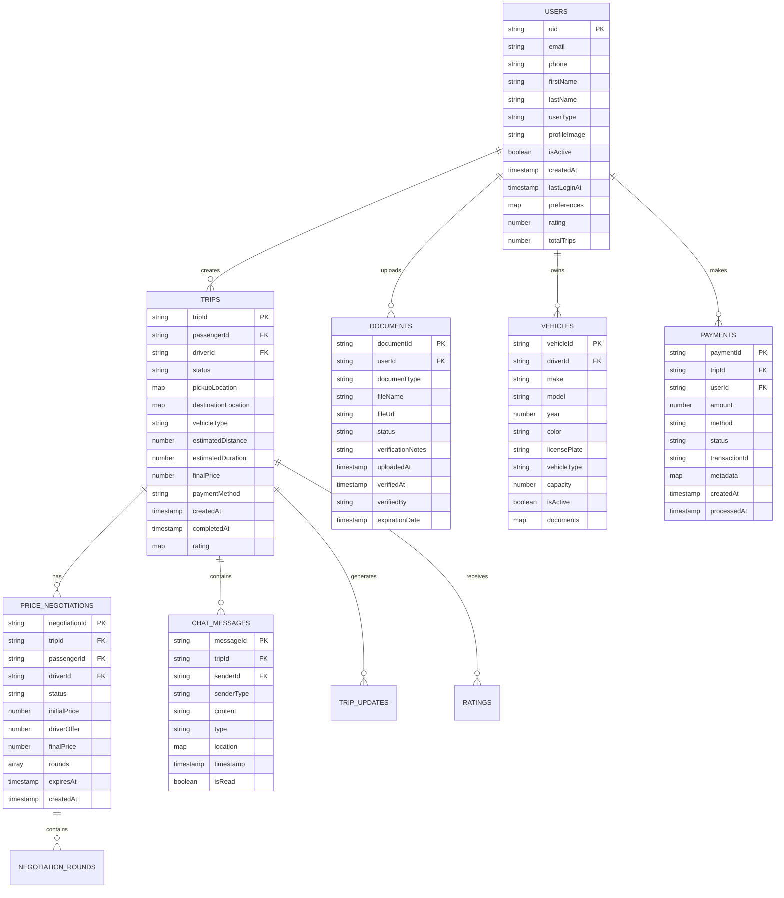

## 🌐 ARQUITECTURA DE RED

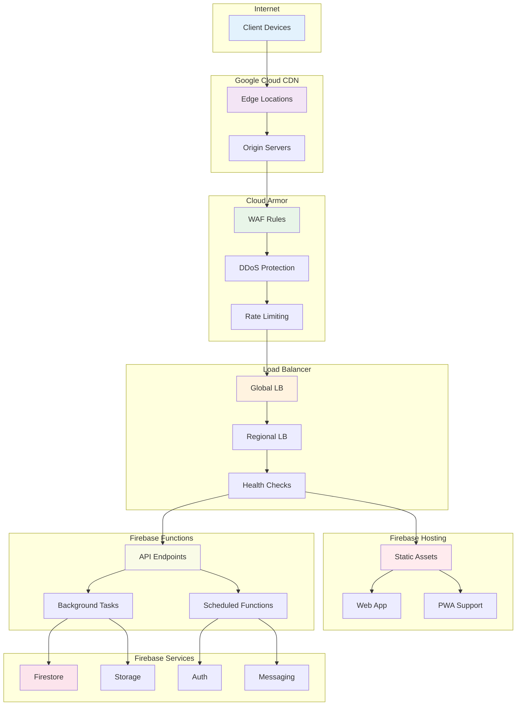

## 📊 ARQUITECTURA DE ANALYTICS

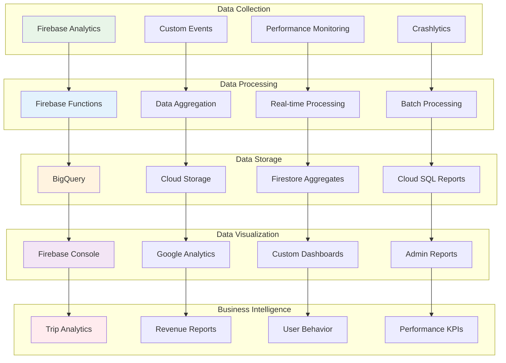

## 🔧 ARQUITECTURA DE DEPLOYMENT

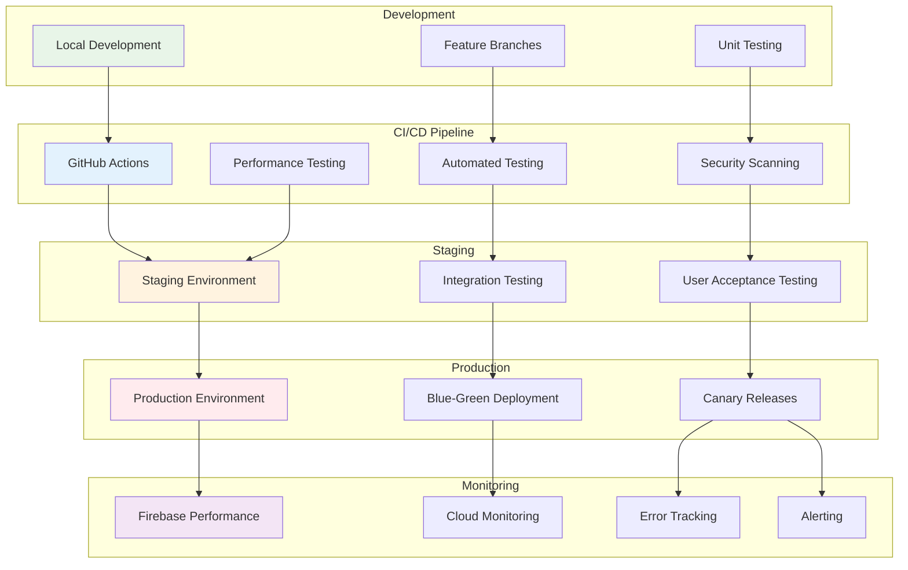

## 📱 RESPONSIVE DESIGN ARCHITECTURE

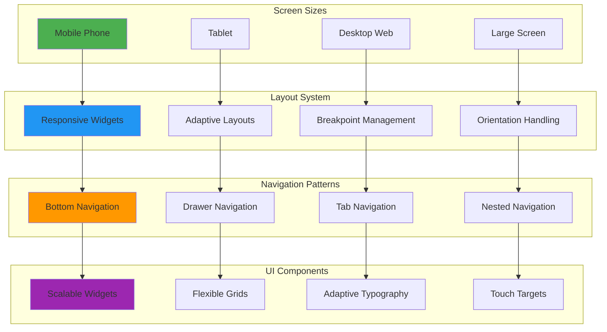

## 🌍 DISTRIBUCIÓN GEOGRÁFICA

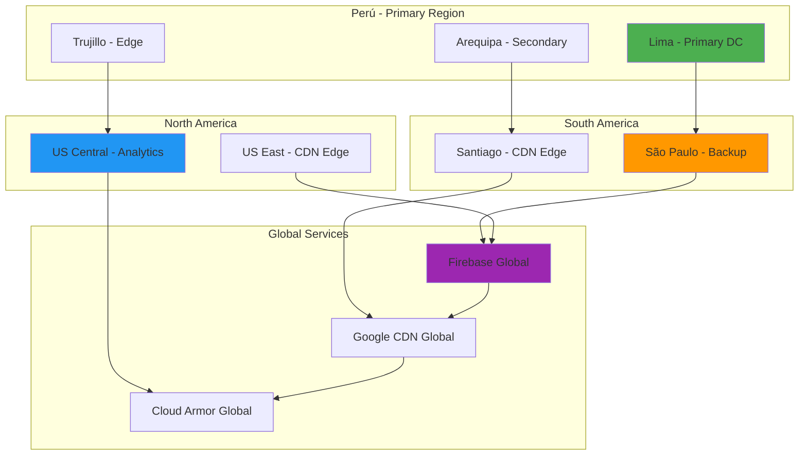

---

**Versión de Diagramas:** 1.0.0  
**Última Actualización:** Enero 2025  
**Herramientas Utilizadas:** Mermaid.js  
**Mantenido por:** OasisTaxi Development Team

**Notas:**
- Todos los diagramas están en formato Mermaid para fácil edición
- Los diagramas se pueden renderizar en cualquier herramienta compatible con Mermaid
- Para modificaciones, actualizar este archivo y regenerar las imágenes según sea necesario