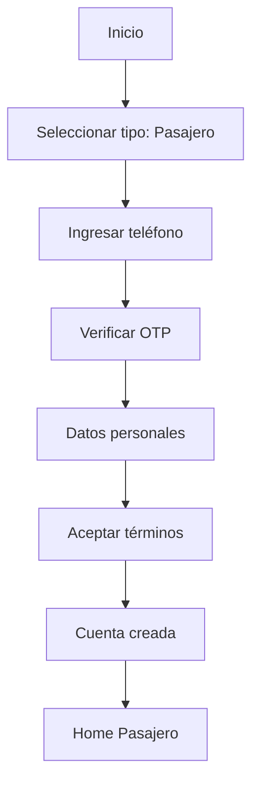
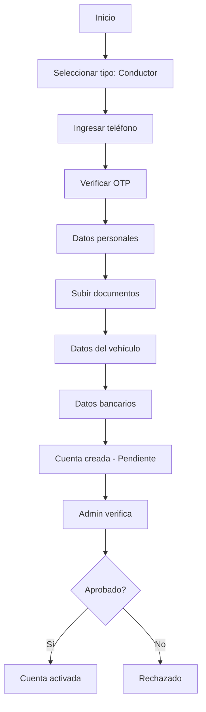
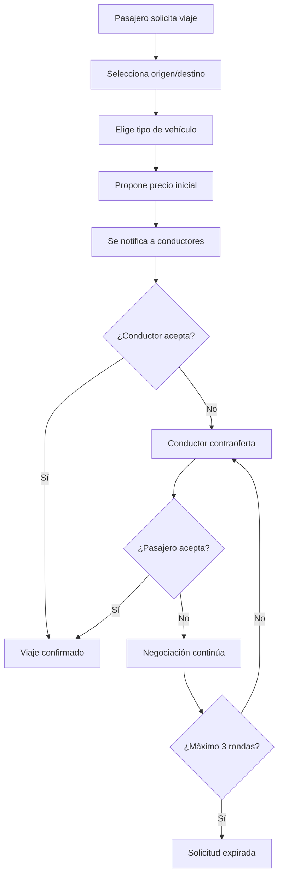

# 📋 DOCUMENTACIÓN TÉCNICA COMPLETA - OASISTAXI PERÚ

## 🏗️ ARQUITECTURA DEL SISTEMA

### Visión General
OasisTaxi es una aplicación de transporte desarrollada con Flutter, Firebase y Google Cloud Platform, diseñada específicamente para el mercado peruano con funcionalidades de negociación de precios.

### Stack Tecnológico Principal
```yaml
Frontend:
  - Flutter 3.24.0+ (Dart 3.4.0+)
  - Provider para gestión de estado
  - Material Design 3
  - Responsive design para móvil y web

Backend & Servicios:
  - Firebase Authentication (Phone + Google OAuth)
  - Cloud Firestore (Base de datos NoSQL)
  - Firebase Storage (Archivos y documentos)
  - Firebase Functions (Lógica de negocio)
  - Firebase Hosting (Landing page)
  - Cloud Messaging (Notificaciones push)

Infraestructura:
  - Google Cloud Platform
  - Cloud CDN para optimización
  - Cloud Armor para seguridad
  - Load Balancing para escalabilidad
  - Identity Platform para autenticación avanzada
```

## 🎯 ARQUITECTURA POR CAPAS

### 1. Capa de Presentación (UI)
```
lib/screens/
├── auth/               # Autenticación y registro
│   ├── modern_login_screen.dart
│   ├── modern_register_screen.dart
│   ├── phone_verification_screen.dart
│   ├── forgot_password_screen.dart
│   └── modern_splash_screen.dart
├── passenger/          # Funcionalidades de pasajero
│   ├── modern_passenger_home.dart
│   ├── tracking_screen.dart
│   ├── profile_screen.dart
│   └── trip_history_screen.dart
├── driver/            # Funcionalidades de conductor
│   ├── modern_driver_home.dart
│   ├── earnings_details_screen.dart
│   ├── vehicle_management_screen.dart
│   └── documents_screen.dart
├── admin/             # Panel administrativo
│   ├── admin_dashboard_screen.dart
│   ├── users_management_screen.dart
│   ├── drivers_management_screen.dart
│   └── analytics_screen.dart
└── shared/            # Pantallas compartidas
    ├── chat_screen.dart
    ├── notifications_screen.dart
    ├── settings_screen.dart
    └── help_center_screen.dart
```

### 2. Capa de Lógica de Negocio (Providers)
```
lib/providers/
├── auth_provider.dart              # Gestión de autenticación
├── location_provider.dart          # Servicios de ubicación
├── ride_provider.dart              # Gestión de viajes
├── price_negotiation_provider.dart # Negociación de precios
├── payment_provider.dart           # Procesamiento de pagos
├── chat_provider.dart              # Sistema de chat
├── notification_provider.dart      # Notificaciones
├── vehicle_provider.dart           # Gestión de vehículos
├── document_provider.dart          # Verificación de documentos
└── wallet_provider.dart            # Sistema de billetera
```

### 3. Capa de Servicios (Services)
```
lib/services/
├── firebase_service.dart           # Operaciones Firebase
├── location_service.dart           # GPS y geolocalización
├── payment_service.dart            # Integración MercadoPago
├── notification_service.dart       # FCM y notificaciones locales
├── google_maps_service.dart        # Integración Google Maps
├── chat_service.dart              # Mensajería en tiempo real
├── tracking_service.dart          # Seguimiento de viajes
├── security_service.dart          # Servicios de seguridad
├── emergency_service.dart         # Sistema de emergencias
└── fcm_service.dart               # Firebase Cloud Messaging
```

### 4. Capa de Datos (Models)
```
lib/models/
├── user_model.dart                 # Modelo de usuario
├── trip_model.dart                 # Modelo de viaje
├── vehicle_model.dart              # Modelo de vehículo
├── price_negotiation_model.dart    # Modelo de negociación
├── payment_model.dart              # Modelo de pago
├── notification_model.dart         # Modelo de notificación
├── document_model.dart             # Modelo de documento
├── driver_model.dart               # Modelo de conductor
└── service_type_model.dart         # Tipos de servicio
```

## 🔐 ARQUITECTURA DE SEGURIDAD

### Autenticación Multi-Nivel
```yaml
Nivel 1 - Usuario Regular:
  - Phone verification (OTP)
  - Google OAuth 2.0
  - Biometric authentication (opcional)

Nivel 2 - Conductor:
  - Todo lo anterior +
  - Document verification
  - Background check
  - Vehicle registration

Nivel 3 - Administrador:
  - Todo lo anterior +
  - 2FA obligatorio
  - IP whitelisting
  - Session timeout reducido
```

### Firestore Security Rules
```javascript
// Reglas de seguridad para usuarios
match /users/{userId} {
  allow read, write: if request.auth != null && request.auth.uid == userId;
  allow read: if request.auth != null && 
    exists(/databases/$(database)/documents/admins/$(request.auth.uid));
}

// Reglas de seguridad para viajes
match /trips/{tripId} {
  allow read, write: if request.auth != null && 
    (resource.data.passengerId == request.auth.uid || 
     resource.data.driverId == request.auth.uid);
}

// Reglas de seguridad para documentos
match /documents/{docId} {
  allow read, write: if request.auth != null && 
    resource.data.userId == request.auth.uid;
  allow read: if request.auth != null && 
    exists(/databases/$(database)/documents/admins/$(request.auth.uid));
}
```

## 🚗 FLUJOS DE NEGOCIO PRINCIPALES

### 1. Flujo de Registro de Pasajero


### 2. Flujo de Registro de Conductor


### 3. Flujo de Solicitud de Viaje con Negociación


## 💾 ESTRUCTURA DE BASE DE DATOS (FIRESTORE)

### Colecciones Principales

#### 1. users
```json
{
  "userId": {
    "email": "usuario@email.com",
    "phone": "+51987654321",
    "firstName": "Juan",
    "lastName": "Pérez",
    "userType": "passenger|driver|admin",
    "profileImage": "gs://storage/path/image.jpg",
    "isActive": true,
    "createdAt": "timestamp",
    "lastLoginAt": "timestamp",
    "deviceTokens": ["fcm_token_1", "fcm_token_2"],
    "preferences": {
      "language": "es",
      "notifications": true,
      "biometricAuth": false
    }
  }
}
```

#### 2. trips
```json
{
  "tripId": {
    "passengerId": "user_id",
    "driverId": "driver_id",
    "status": "requested|accepted|in_progress|completed|cancelled",
    "pickupLocation": {
      "latitude": -12.0464,
      "longitude": -77.0428,
      "address": "Av. Javier Prado Este 1066, San Isidro"
    },
    "destinationLocation": {
      "latitude": -12.0931,
      "longitude": -77.0465,
      "address": "Centro Histórico de Lima"
    },
    "vehicleType": "economic|comfort|premium",
    "estimatedDistance": 5.2,
    "estimatedDuration": 20,
    "finalPrice": 15.50,
    "paymentMethod": "cash|card|wallet",
    "createdAt": "timestamp",
    "startedAt": "timestamp",
    "completedAt": "timestamp",
    "rating": {
      "passengerRating": 5,
      "driverRating": 4,
      "passengerComment": "Excelente servicio",
      "driverComment": "Pasajero puntual"
    }
  }
}
```

#### 3. price_negotiations
```json
{
  "negotiationId": {
    "tripId": "trip_id",
    "passengerId": "user_id",
    "driverId": "driver_id",
    "status": "waitingDriver|driverOffered|accepted|rejected|expired",
    "initialPrice": 12.00,
    "driverOffer": 15.00,
    "finalPrice": 14.00,
    "rounds": [
      {
        "round": 1,
        "proposedBy": "passenger",
        "amount": 12.00,
        "timestamp": "timestamp"
      },
      {
        "round": 2,
        "proposedBy": "driver",
        "amount": 15.00,
        "timestamp": "timestamp"
      }
    ],
    "expiresAt": "timestamp",
    "createdAt": "timestamp"
  }
}
```

#### 4. vehicles
```json
{
  "vehicleId": {
    "driverId": "driver_id",
    "make": "Toyota",
    "model": "Yaris",
    "year": 2020,
    "color": "Blanco",
    "licensePlate": "ABC-123",
    "vehicleType": "economic|comfort|premium",
    "capacity": 4,
    "isActive": true,
    "documents": {
      "soat": {
        "url": "gs://storage/path/soat.pdf",
        "verified": true,
        "expirationDate": "timestamp"
      },
      "techReview": {
        "url": "gs://storage/path/revision.pdf",
        "verified": true,
        "expirationDate": "timestamp"
      }
    }
  }
}
```

#### 5. documents
```json
{
  "documentId": {
    "userId": "user_id",
    "documentType": "license|dni|soat|techReview|criminalRecord",
    "fileName": "licencia_conducir.pdf",
    "fileUrl": "gs://storage/path/document.pdf",
    "status": "pending|approved|rejected",
    "verificationNotes": "Documento aprobado",
    "uploadedAt": "timestamp",
    "verifiedAt": "timestamp",
    "verifiedBy": "admin_user_id",
    "expirationDate": "timestamp"
  }
}
```

## 🔧 CONFIGURACIÓN DE SERVICIOS

### Firebase Configuration
```dart
// firebase_options.dart
class DefaultFirebaseOptions {
  static FirebaseOptions get currentPlatform {
    return FirebaseOptions(
      apiKey: 'AIzaSyC...',
      appId: '1:123456789:android:abc123',
      messagingSenderId: '123456789',
      projectId: 'oasis-taxi-peru',
      storageBucket: 'oasis-taxi-peru.appspot.com',
      iosClientId: '123456789-abc.apps.googleusercontent.com',
      androidClientId: '123456789-def.apps.googleusercontent.com',
    );
  }
}
```

### Google Maps Configuration
```dart
// core/config/app_config.dart
class AppConfig {
  static const String googleMapsApiKey = 'AIzaSyB...';
  static const String mercadoPagoPublicKey = 'APP_USR...';
  static const String oneSignalAppId = '12345678-1234-1234-1234-123456789012';
  
  // Configuración específica para Perú
  static const Map<String, double> peruBounds = {
    'northEast': {'lat': -0.012977, 'lng': -68.652287},
    'southWest': {'lat': -18.351307, 'lng': -81.326397},
  };
}
```

### Environment Variables (.env)
```bash
# Firebase Configuration
FIREBASE_API_KEY=AIzaSyC...
FIREBASE_PROJECT_ID=oasis-taxi-peru
FIREBASE_MESSAGING_SENDER_ID=123456789
FIREBASE_APP_ID_ANDROID=1:123456789:android:abc123
FIREBASE_APP_ID_IOS=1:123456789:ios:def456

# Google Services
GOOGLE_MAPS_API_KEY=AIzaSyB...
GOOGLE_OAUTH_CLIENT_ID_ANDROID=123456789-abc.apps.googleusercontent.com
GOOGLE_OAUTH_CLIENT_ID_IOS=123456789-def.apps.googleusercontent.com

# Payment Services
MERCADOPAGO_PUBLIC_KEY=APP_USR...
MERCADOPAGO_ACCESS_TOKEN=APP_USR...

# Notification Services
ONESIGNAL_APP_ID=12345678-1234-1234-1234-123456789012

# Security
SECRET_KEY=your_secret_key_here
ENCRYPTION_KEY=your_encryption_key_here
```

## 🚀 DEPLOY Y CONFIGURACIÓN DE PRODUCCIÓN

### Firebase Hosting
```yaml
# firebase.json
{
  "hosting": {
    "public": "build/web",
    "site": "oasistaxiperu",
    "ignore": [
      "firebase.json",
      "**/.*",
      "**/node_modules/**"
    ],
    "rewrites": [
      {
        "source": "**",
        "destination": "/index.html"
      }
    ],
    "headers": [
      {
        "source": "**/*.@(eot|otf|ttf|ttc|woff|font.css)",
        "headers": [
          {
            "key": "Access-Control-Allow-Origin",
            "value": "*"
          }
        ]
      }
    ]
  }
}
```

### Cloud Functions
```javascript
// functions/index.js
const functions = require('firebase-functions');
const admin = require('firebase-admin');

admin.initializeApp();

// Notificación cuando se solicita un viaje
exports.notifyDriversNewTrip = functions.firestore
  .document('trips/{tripId}')
  .onCreate(async (snap, context) => {
    const tripData = snap.data();
    const nearbyDrivers = await findNearbyDrivers(
      tripData.pickupLocation,
      tripData.vehicleType
    );
    
    for (const driver of nearbyDrivers) {
      await sendNotificationToDriver(driver.id, {
        title: 'Nueva solicitud de viaje',
        body: `Viaje desde ${tripData.pickupLocation.address}`,
        data: {
          tripId: context.params.tripId,
          type: 'new_trip_request'
        }
      });
    }
  });

// Webhook para MercadoPago
exports.mercadopagoWebhook = functions.https.onRequest(async (req, res) => {
  const { data, type } = req.body;
  
  if (type === 'payment') {
    const paymentId = data.id;
    const payment = await getMercadoPagoPayment(paymentId);
    
    if (payment.status === 'approved') {
      await updateTripPayment(payment.external_reference, {
        status: 'paid',
        paymentId: paymentId,
        amount: payment.transaction_amount
      });
    }
  }
  
  res.status(200).send('OK');
});
```

## 📱 GUÍAS DE TESTING

### Testing Unitario
```dart
// test/providers/auth_provider_test.dart
import 'package:flutter_test/flutter_test.dart';
import 'package:mockito/mockito.dart';
import '../lib/providers/auth_provider.dart';

void main() {
  group('AuthProvider Tests', () {
    late AuthProvider authProvider;
    
    setUp(() {
      authProvider = AuthProvider();
    });
    
    test('should authenticate with phone number', () async {
      // Arrange
      const phoneNumber = '+51987654321';
      
      // Act
      final result = await authProvider.signInWithPhone(phoneNumber);
      
      // Assert
      expect(result, isTrue);
      expect(authProvider.isAuthenticated, isTrue);
    });
    
    test('should handle invalid phone number', () async {
      // Arrange
      const invalidPhone = '123';
      
      // Act & Assert
      expect(
        () => authProvider.signInWithPhone(invalidPhone),
        throwsA(isA<FormatException>())
      );
    });
  });
}
```

### Testing de Integración
```dart
// integration_test/app_test.dart
import 'package:flutter/material.dart';
import 'package:flutter_test/flutter_test.dart';
import 'package:integration_test/integration_test.dart';
import 'package:oasis_taxi/main.dart' as app;

void main() {
  IntegrationTestWidgetsFlutterBinding.ensureInitialized();
  
  group('OasisTaxi App Tests', () {
    testWidgets('complete passenger flow', (WidgetTester tester) async {
      // Launch app
      app.main();
      await tester.pumpAndSettle();
      
      // Register as passenger
      await tester.tap(find.text('Soy Pasajero'));
      await tester.pumpAndSettle();
      
      // Enter phone number
      await tester.enterText(
        find.byType(TextFormField),
        '+51987654321'
      );
      await tester.tap(find.text('Continuar'));
      await tester.pumpAndSettle();
      
      // Verify home screen
      expect(find.text('¿A dónde vamos?'), findsOneWidget);
    });
  });
}
```

## 🔍 MONITOREO Y ANALYTICS

### Firebase Analytics Events
```dart
// utils/analytics_helper.dart
class AnalyticsHelper {
  static Future<void> logTripRequested({
    required String vehicleType,
    required double estimatedPrice,
    required String origin,
    required String destination,
  }) async {
    await FirebaseAnalytics.instance.logEvent(
      name: 'trip_requested',
      parameters: {
        'vehicle_type': vehicleType,
        'estimated_price': estimatedPrice,
        'origin': origin,
        'destination': destination,
        'timestamp': DateTime.now().millisecondsSinceEpoch,
      },
    );
  }
  
  static Future<void> logPriceNegotiation({
    required String negotiationId,
    required double initialPrice,
    required double finalPrice,
    required int rounds,
  }) async {
    await FirebaseAnalytics.instance.logEvent(
      name: 'price_negotiation_completed',
      parameters: {
        'negotiation_id': negotiationId,
        'initial_price': initialPrice,
        'final_price': finalPrice,
        'negotiation_rounds': rounds,
        'price_difference': finalPrice - initialPrice,
      },
    );
  }
}
```

### Performance Monitoring
```dart
// utils/performance_helper.dart
class PerformanceHelper {
  static Future<T> trackOperation<T>(
    String operationName,
    Future<T> Function() operation,
  ) async {
    final trace = FirebasePerformance.instance.newTrace(operationName);
    await trace.start();
    
    try {
      final result = await operation();
      trace.setMetric('success', 1);
      return result;
    } catch (e) {
      trace.setMetric('error', 1);
      rethrow;
    } finally {
      await trace.stop();
    }
  }
}
```

## 🛠️ TROUBLESHOOTING COMÚN

### Problemas de Autenticación
```yaml
Error: "Network error occurred"
Solución:
  - Verificar conectividad a internet
  - Comprobar configuración Firebase
  - Revisar API keys en .env

Error: "Phone verification failed"
Solución:
  - Verificar formato del número (+51XXXXXXXXX)
  - Comprobar configuración SMS en Firebase Console
  - Revisar límites de SMS diarios
```

### Problemas de Ubicación
```yaml
Error: "Location permission denied"
Solución:
  - Solicitar permisos explícitamente
  - Guiar al usuario a configuración
  - Implementar fallback manual

Error: "Location timeout"
Solución:
  - Aumentar timeout a 10 segundos
  - Implementar retry mechanism
  - Usar última ubicación conocida
```

### Problemas de Pagos
```yaml
Error: "Payment failed"
Solución:
  - Verificar credentials MercadoPago
  - Comprobar status de la tarjeta
  - Revisar logs de webhook

Error: "Webhook not received"
Solución:
  - Verificar URL del webhook en MercadoPago
  - Comprobar HTTPS y certificados
  - Revisar logs de Cloud Functions
```

## 📞 CONTACTO Y SOPORTE TÉCNICO

### Equipo de Desarrollo
```yaml
Tech Lead: OasisTaxi Development Team
Email: dev@oasistaxiperu.com
Slack: #oasistaxi-dev
Documentación: https://docs.oasistaxiperu.com

Servicios de Emergencia:
- Firebase Support: firebase-support@google.com
- Google Cloud Support: Nivel Premium
- MercadoPago Support: developers@mercadopago.com
```

### Recursos Adicionales
- [Firebase Console](https://console.firebase.google.com/project/oasis-taxi-peru)
- [Google Cloud Console](https://console.cloud.google.com/)
- [MercadoPago Dashboard](https://www.mercadopago.com.pe/developers)
- [Flutter Documentation](https://docs.flutter.dev/)
- [Provider Package](https://pub.dev/packages/provider)

---

**Versión:** 1.0.0  
**Última actualización:** Enero 2025  
**Estado:** Producción Ready  
**Mantenido por:** OasisTaxi Development Team