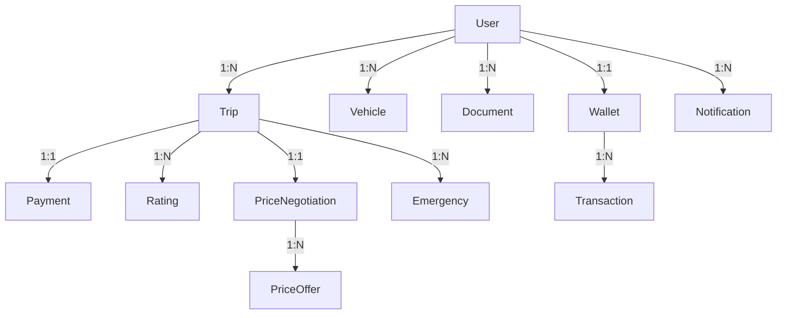

# Data Model - OasisTaxi App

**Feature**: Auditoría y Optimización Completa
**Branch**: 001-auditor-a-y
**Date**: 2025-01-14

## Overview

Modelo de datos completo para la aplicación OasisTaxi, diseñado para soportar tres tipos de usuarios (pasajero, conductor, administrador) con funcionalidad de negociación de precios en tiempo real.

## Core Entities

### 1. Usuario (User)

```dart
class User {
  String uid;                  // Firebase Auth UID
  String email;                // Email único
  String phoneNumber;          // +51 XXX XXX XXX
  String displayName;          // Nombre completo
  String photoUrl?;            // Foto de perfil
  UserRole role;               // passenger | driver | admin
  bool isActive;               // Estado de cuenta
  bool emailVerified;          // Email verificado
  bool phoneVerified;          // Teléfono verificado (OTP)
  bool mfaEnabled;             // 2FA habilitado (admin)
  DateTime createdAt;          // Fecha registro
  DateTime lastLogin;          // Último acceso
  Map<String, dynamic> metadata; // Datos adicionales por rol
}

enum UserRole {
  passenger,
  driver,
  admin
}
```

**Validaciones**:
- Email: formato válido, único
- Phone: formato +51, único
- Role: solo valores del enum
- DisplayName: 3-50 caracteres

**Estados**: active → suspended → deleted

### 2. Viaje (Trip)

```dart
class Trip {
  String tripId;               // ID único
  String passengerId;          // Ref: User.uid
  String? driverId;            // Ref: User.uid (null hasta aceptado)
  TripStatus status;           // Estado del viaje
  Location pickupLocation;     // Origen
  Location destinationLocation; // Destino
  double estimatedDistance;    // Km estimados
  double? actualDistance;      // Km reales
  double agreedPrice;          // Precio negociado final
  String? verificationCode;    // Código 4 dígitos
  DateTime requestedAt;        // Hora solicitud
  DateTime? acceptedAt;        // Hora aceptación
  DateTime? startedAt;         // Hora inicio viaje
  DateTime? completedAt;       // Hora fin
  String? cancellationReason;  // Si fue cancelado
  String vehicleType;          // economy | comfort | premium
  PaymentMethod paymentMethod; // cash | card | wallet
}

enum TripStatus {
  requested,        // Solicitado por pasajero
  negotiating,      // En negociación de precio
  accepted,         // Aceptado por conductor
  driverArrived,    // Conductor llegó
  inProgress,       // Viaje en curso
  completed,        // Completado
  cancelled,        // Cancelado
  disputed          // En disputa
}
```

**Validaciones**:
- Precio: >0 y <1000 soles
- Distancia: >0.1km y <200km
- VerificationCode: 4 dígitos

**Transiciones de Estado**:
```
requested → negotiating → accepted → driverArrived → inProgress → completed
          ↘ cancelled     ↘ cancelled  ↘ cancelled    ↘ cancelled
                                                       ↘ disputed
```

### 3. Vehículo (Vehicle)

```dart
class Vehicle {
  String vehicleId;            // ID único
  String driverId;             // Ref: User.uid
  String brand;                // Marca
  String model;                // Modelo
  int year;                    // Año
  String licensePlate;         // Placa única
  String color;                // Color
  VehicleType type;            // Tipo/categoría
  int maxPassengers;           // Capacidad
  bool isActive;               // Activo para viajes
  bool isVerified;             // Verificado por admin
  DateTime registeredAt;       // Fecha registro
  DateTime? verifiedAt;        // Fecha verificación
  String? verifiedBy;          // Admin que verificó
}

enum VehicleType {
  economy,     // Económico (básico)
  comfort,     // Comfort (estándar)
  premium,     // Premium (ejecutivo)
  xl           // XL (7+ pasajeros)
}
```

**Validaciones**:
- LicensePlate: formato peruano, único
- Year: >2010 y <=año actual
- MaxPassengers: 1-8

### 4. Documento (Document)

```dart
class Document {
  String documentId;           // ID único
  String userId;               // Ref: User.uid (conductor)
  DocumentType type;           // Tipo documento
  String documentNumber;       // Número documento
  String? fileUrl;             // URL en Storage
  DocumentStatus status;       // Estado verificación
  DateTime uploadedAt;         // Fecha carga
  DateTime? verifiedAt;        // Fecha verificación
  String? verifiedBy;          // Admin verificador
  DateTime expiryDate;         // Fecha vencimiento
  String? rejectionReason;     // Si fue rechazado
}

enum DocumentType {
  dni,                // DNI
  driverLicense,      // Licencia conducir
  criminalRecord,     // Antecedentes penales
  soat,              // SOAT
  vehicleRegistration, // Tarjeta propiedad
  bankAccount        // Cuenta bancaria
}

enum DocumentStatus {
  pending,    // Pendiente revisión
  verified,   // Verificado
  rejected,   // Rechazado
  expired     // Expirado
}
```

**Validaciones**:
- DocumentNumber: formato según tipo
- ExpiryDate: futura
- FileUrl: Storage válido

### 5. Pago (Payment)

```dart
class Payment {
  String paymentId;            // ID único
  String tripId;               // Ref: Trip.tripId
  String passengerId;          // Ref: User.uid
  String driverId;             // Ref: User.uid
  double amount;               // Monto total
  double driverAmount;         // Monto conductor (80%)
  double platformFee;          // Comisión (20%)
  PaymentMethod method;        // Método pago
  PaymentStatus status;        // Estado
  DateTime createdAt;          // Fecha creación
  DateTime? processedAt;       // Fecha procesamiento
  String? transactionId;       // ID MercadoPago
  String? failureReason;       // Si falló
}

enum PaymentMethod {
  cash,       // Efectivo
  card,       // Tarjeta vía MercadoPago
  wallet      // Wallet digital app
}

enum PaymentStatus {
  pending,    // Pendiente
  processing, // Procesando
  completed,  // Completado
  failed,     // Fallido
  refunded    // Reembolsado
}
```

**Validaciones**:
- Amount: >0
- PlatformFee: 20% del amount
- DriverAmount: 80% del amount

### 6. Calificación (Rating)

```dart
class Rating {
  String ratingId;             // ID único
  String tripId;               // Ref: Trip.tripId
  String fromUserId;           // Quien califica
  String toUserId;             // Quien es calificado
  int stars;                   // 1-5 estrellas
  String? comment;             // Comentario opcional
  List<String> tags;           // Tags predefinidos
  DateTime createdAt;          // Fecha
  bool isFromPassenger;        // true=pasajero, false=conductor
}
```

**Validaciones**:
- Stars: 1-5
- Comment: max 500 caracteres
- Tags: máximo 5

### 7. Wallet

```dart
class Wallet {
  String walletId;             // ID único
  String userId;               // Ref: User.uid (conductor)
  double balance;              // Balance actual
  double totalEarnings;        // Ganancias totales
  double totalWithdrawals;     // Retiros totales
  DateTime lastTransaction;    // Última transacción
  List<Transaction> transactions; // Historial
}

class Transaction {
  String transactionId;        // ID único
  TransactionType type;        // Tipo
  double amount;               // Monto
  double balanceBefore;        // Balance anterior
  double balanceAfter;         // Balance posterior
  String? referenceId;         // Ref: tripId o withdrawalId
  String description;          // Descripción
  DateTime createdAt;          // Fecha
}

enum TransactionType {
  earning,     // Ganancia de viaje
  withdrawal,  // Retiro
  bonus,       // Bonus plataforma
  penalty      // Penalización
}
```

**Validaciones**:
- Balance: >=0
- Amount: >0
- Withdrawal: <=balance

### 8. Negociación de Precio (PriceNegotiation)

```dart
class PriceNegotiation {
  String negotiationId;        // ID único
  String tripId;               // Ref: Trip.tripId
  String passengerId;          // Ref: User.uid
  double initialPrice;         // Precio inicial pasajero
  List<PriceOffer> offers;     // Ofertas/contraofertas
  double? agreedPrice;         // Precio final acordado
  NegotiationStatus status;    // Estado
  DateTime createdAt;          // Inicio negociación
  DateTime? completedAt;       // Fin negociación
  int offerCount;              // Número de ofertas
}

class PriceOffer {
  String offerId;              // ID único
  String driverId;             // Ref: User.uid
  double offeredPrice;         // Precio ofrecido
  DateTime offeredAt;          // Hora oferta
  bool isCounterOffer;         // Es contraoferta
  bool wasAccepted;            // Fue aceptada
}

enum NegotiationStatus {
  open,        // Abierta a ofertas
  negotiating, // En negociación activa
  agreed,      // Precio acordado
  expired,     // Expirada sin acuerdo
  cancelled    // Cancelada
}
```

**Validaciones**:
- OfferCount: máximo 10
- Timeout: 5 minutos
- Price range: ±50% del inicial

### 9. Emergencia (Emergency)

```dart
class Emergency {
  String emergencyId;          // ID único
  String tripId;               // Ref: Trip.tripId
  String reporterId;           // Quien reporta
  EmergencyType type;          // Tipo emergencia
  String description;          // Descripción
  Location? location;          // Ubicación GPS
  EmergencyStatus status;      // Estado
  DateTime reportedAt;         // Hora reporte
  DateTime? resolvedAt;        // Hora resolución
  String? resolutionNotes;     // Notas resolución
  List<String> notifiedContacts; // Contactos notificados
}

enum EmergencyType {
  accident,    // Accidente
  assault,     // Asalto
  breakdown,   // Avería vehículo
  medical,     // Emergencia médica
  other        // Otro
}

enum EmergencyStatus {
  reported,    // Reportada
  responding,  // En respuesta
  resolved,    // Resuelta
  false_alarm  // Falsa alarma
}
```

### 10. Notificación (Notification)

```dart
class Notification {
  String notificationId;       // ID único
  String userId;               // Ref: User.uid destinatario
  NotificationType type;       // Tipo notificación
  String title;                // Título
  String body;                 // Mensaje
  Map<String, dynamic> data;   // Data adicional
  bool isRead;                 // Leída
  DateTime createdAt;          // Fecha creación
  DateTime? readAt;            // Fecha lectura
  String? actionUrl;           // Deep link
  NotificationPriority priority; // Prioridad
}

enum NotificationType {
  tripRequest,      // Nueva solicitud viaje
  tripAccepted,     // Viaje aceptado
  driverArrived,    // Conductor llegó
  tripStarted,      // Viaje iniciado
  tripCompleted,    // Viaje completado
  paymentReceived,  // Pago recibido
  priceOffer,       // Oferta de precio
  documentStatus,   // Estado documento
  emergency,        // Emergencia
  system            // Sistema/Mantenimiento
}

enum NotificationPriority {
  low,
  normal,
  high,
  critical
}
```

## Relaciones



## Índices Firestore Requeridos

```javascript
// Compound indexes needed
trips: [passengerId, status, requestedAt DESC]
trips: [driverId, status, acceptedAt DESC]
trips: [status, vehicleType, requestedAt DESC]
documents: [userId, type, status]
documents: [status, uploadedAt DESC]
payments: [driverId, status, createdAt DESC]
notifications: [userId, isRead, createdAt DESC]
priceNegotiations: [status, createdAt DESC]
emergencies: [tripId, status]
ratings: [toUserId, createdAt DESC]
```

## Security Rules Pattern

```javascript
// Firestore security rules base pattern
match /users/{userId} {
  allow read: if request.auth != null;
  allow write: if request.auth.uid == userId;
}

match /trips/{tripId} {
  allow read: if request.auth != null &&
    (resource.data.passengerId == request.auth.uid ||
     resource.data.driverId == request.auth.uid ||
     isAdmin());
  allow create: if request.auth != null &&
    request.auth.uid == request.resource.data.passengerId;
  allow update: if canUpdateTrip();
}

function isAdmin() {
  return get(/databases/$(database)/documents/users/$(request.auth.uid))
    .data.role == 'admin';
}

function canUpdateTrip() {
  return request.auth != null &&
    (resource.data.passengerId == request.auth.uid ||
     resource.data.driverId == request.auth.uid);
}
```

## Data Validation Rules

### Required Fields by Entity
- **User**: email, phoneNumber, displayName, role
- **Trip**: passengerId, pickupLocation, destinationLocation, vehicleType
- **Vehicle**: driverId, licensePlate, type
- **Document**: userId, type, documentNumber, expiryDate
- **Payment**: tripId, amount, method
- **Rating**: tripId, fromUserId, toUserId, stars
- **Wallet**: userId, balance
- **PriceNegotiation**: tripId, passengerId, initialPrice
- **Emergency**: tripId, reporterId, type
- **Notification**: userId, type, title, body

### Format Validations
- **Emails**: RFC 5322 compliant
- **Phones**: +51 followed by 9 digits
- **License Plates**: Peruvian format (AAA-123 or A1A-123)
- **DNI**: 8 digits
- **Prices**: 2 decimal places, soles (S/)
- **Dates**: ISO 8601 format
- **GPS Coordinates**: lat (-90 to 90), lng (-180 to 180)

---
*Data Model v1.0 - Generated for OasisTaxi App Audit*
*All entities support soft delete with isDeleted flag*